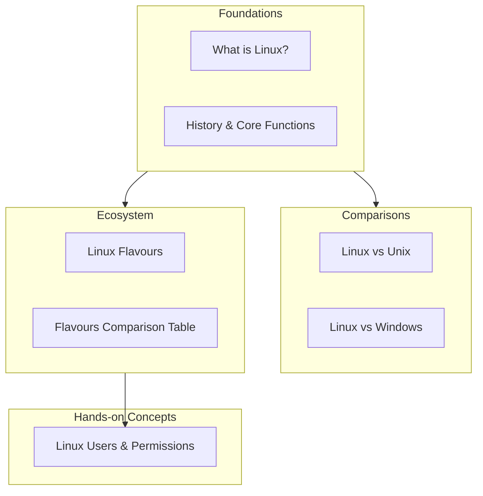

# 1. Section Overview

[← Back to Index](README.md) | [Next: Introduction to Linux →](02-introduction-to-linux.md)

---

## 🎯 What This Module Covers

This module builds your Linux foundation from the ground up — starting with **what Linux actually is**, moving through its **history and core functions**, comparing it to **Unix** and **Windows**, exploring the many **distributions ("flavours")** available, and finishing with how **users and permissions** work.

By the end of this module, you'll be able to answer:

- What is Linux, really — and how is it different from an operating system like Windows?
- Where did Linux come from, and why was it created?
- What are the core jobs every operating system (including Linux) has to do?
- What's the difference between Linux and Unix?
- Why are there so many "versions" of Linux (Ubuntu, Fedora, CentOS...) and how do you pick one?
- How does Linux manage multiple users securely?

## 🧩 Module Structure

## 📖 How to Study This Module

1. **Read topics in order** — later topics (like distro comparisons) assume you understand earlier concepts (like what a kernel is).
2. **Don't skip the diagrams** — Linux concepts like the boot process or the user/permission model are much easier to understand visually than in plain text.
3. **Try the commands** — where practical commands are shown, open a terminal (or an online Linux sandbox) and try them yourself.

## 🖥️ Don't Have Linux Installed?

You don't need to install anything to follow along. Options to practice:

- **WSL (Windows Subsystem for Linux)** — run Linux inside Windows
- **A virtual machine** (VirtualBox / VMware) with Ubuntu
- **Online sandboxes** like [JSLinux](https://bellard.org/jslinux/) or [Katacoda](https://www.katacoda.com/)
- **A cloud VM** (AWS/GCP free tier, or a $5/month VPS)

---

## 🔑 Key Takeaways

- This module takes you from "what is Linux" to "how do users and permissions work" in 8 focused topics.
- Concepts build on each other — study in order for the smoothest experience.
- You'll get the most out of this if you practice commands hands-on, not just read.

---
[← Back to Index](README.md) | [Next: Introduction to Linux →](02-introduction-to-linux.md)
