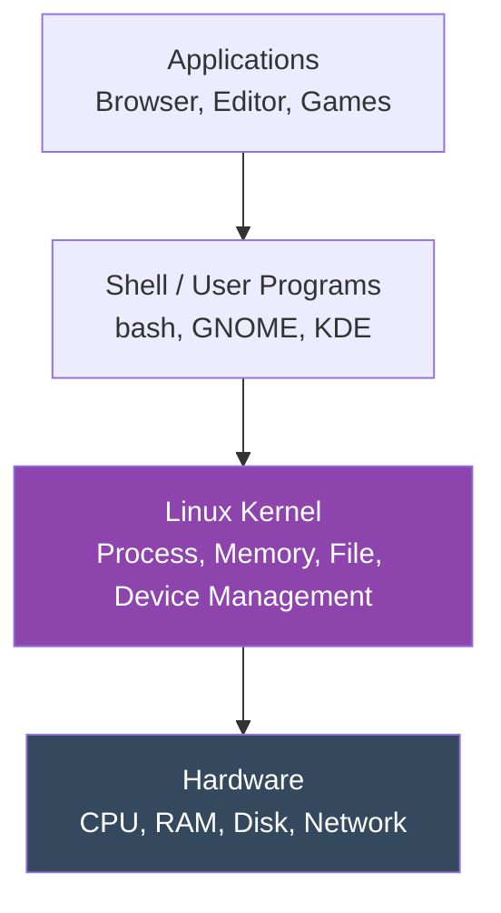
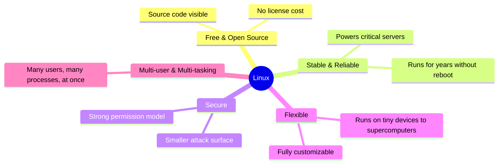

# 2. Introduction to Linux

[← Previous: Section Overview](01-section-overview.md) | [Back to Index](README.md) | [Next: Key Functions, Distributions & History →](03-key-functions-distributions-history.md)

---

## 🐧 What Is Linux?

**Linux** is a free, open-source **operating system kernel** — the core piece of software that lets your computer's hardware (CPU, memory, disks, network card) talk to the programs you run.

> 💡 **Important distinction:** "Linux" technically refers only to the **kernel**. What most people call "Linux" (like Ubuntu or Fedora) is actually a full **operating system** built *around* that kernel — bundled with tools, a package manager, and often a desktop environment. This complete package is more accurately called **GNU/Linux**.

## 🏗️ Where Linux Fits: The OS Stack

- **Hardware** — the physical computer.
- **Kernel (Linux)** — talks directly to hardware, manages resources, enforces security. This is the "engine."
- **Shell / User space** — the tools and interfaces (command line, desktop) you actually interact with.
- **Applications** — the programs you use daily.

## 🧠 Why Was Linux Created?

Linux was created in **1991 by Linus Torvalds**, a Finnish student, as a free alternative to expensive, proprietary Unix systems. He announced it on a newsgroup as a hobby project — not expecting it to become the most widely used OS kernel in the world.

Today, Linux powers:

- 🌐 The majority of the world's **web servers**
- ☁️ Most **cloud infrastructure** (AWS, Azure, GCP run on Linux)
- 📱 **Android** (built on the Linux kernel)
- 🖥️ Supercomputers — **100% of the world's Top 500 supercomputers** run Linux
- 🏠 Routers, smart TVs, and embedded devices

## 🆓 Free and Open Source

Linux is released under the **GNU General Public License (GPL)**, which means:

| Freedom | What It Means |
|---|---|
| **Freedom to run** | Use it for any purpose, personal or commercial |
| **Freedom to study** | Full source code is publicly available |
| **Freedom to modify** | Change the code to suit your needs |
| **Freedom to share** | Redistribute original or modified versions |

This is fundamentally different from **proprietary** software like Windows, where the source code is closed and controlled by one company.

## 🌟 Why Linux Matters (Key Characteristics)

## 🔑 Key Takeaways

- **Linux** = the kernel; **GNU/Linux** = the full OS most people use day-to-day.
- Created by **Linus Torvalds in 1991** as a free, open alternative to Unix.
- It's **free, open-source, secure, and stable** — which is why it dominates servers, cloud computing, and Android.
- Understanding the **stack** (hardware → kernel → shell → applications) helps everything else in this module click into place.

---
[← Previous: Section Overview](01-section-overview.md) | [Back to Index](README.md) | [Next: Key Functions, Distributions & History →](03-key-functions-distributions-history.md)
