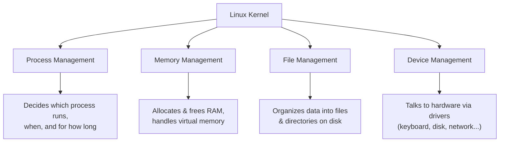
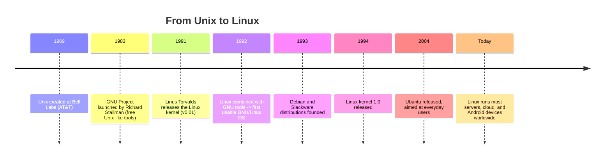
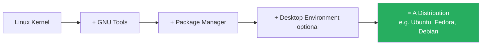

# 3. Key Functions, Linux Distributions and History

[← Previous: Introduction to Linux](02-introduction-to-linux.md) | [Back to Index](README.md) | [Next: Linux vs Unix →](04-linux-vs-unix.md)

---

## ⚙️ Key Functions of the Linux Kernel

Every operating system kernel — Linux included — has four core jobs:

| Function | Description |
|---|---|
| **Process Management** | Creates, schedules, and terminates processes; ensures multitasking works smoothly. |
| **Memory Management** | Allocates RAM to processes, manages virtual memory and swapping. |
| **File Management** | Organizes and controls access to files/directories via the filesystem. |
| **Device Management** | Communicates with hardware devices through drivers, treating most devices as "files." |
| **Security & Permissions** | Controls who can access/modify what, via users, groups, and permissions. |

## 📜 History of Linux — Timeline

### The Story, Briefly

1. **1969** — **Unix** is created at Bell Labs by Ken Thompson and Dennis Ritchie. It becomes the foundation for decades of OS design.
2. **1983** — Richard Stallman starts the **GNU Project**, aiming to build a completely free Unix-like operating system. GNU produced excellent tools (compilers, editors) — but was missing one critical piece: a kernel.
3. **1991** — **Linus Torvalds**, then a university student, writes a kernel as a personal project and shares it publicly. This became the missing piece for GNU.
4. **1992 onward** — The **Linux kernel + GNU tools** combine to form a complete, free operating system: **GNU/Linux**.
5. **1993–2004** — Volunteers and companies package this combination into user-friendly **distributions** (Debian, Red Hat, Slackware, and later Ubuntu).
6. **Today** — Linux is the most widely deployed OS kernel on Earth, powering everything from smartphones to supercomputers.

## 📦 What Is a "Distribution" (Distro)?

The Linux kernel alone isn't usable — it needs to be bundled with system tools, a package manager, and (optionally) a desktop environment. This complete bundle is called a **distribution**, or **distro**.

Think of the kernel as a car engine, and a distribution as the complete car — engine plus everything else needed to actually drive it. Different manufacturers (distros) build different "cars" around the same core engine.

*(We'll explore specific distributions in depth in Topic 5 and 6.)*

## 🔑 Key Takeaways

- The kernel's **four core jobs**: process, memory, file, and device management (plus security).
- Linux traces its roots to **Unix (1969)** and the **GNU Project (1983)**; **Linus Torvalds** wrote the missing kernel in **1991**.
- A **distribution** = kernel + tools + package manager (+ optional desktop) — this is what people actually install and use.

---
[← Previous: Introduction to Linux](02-introduction-to-linux.md) | [Back to Index](README.md) | [Next: Linux vs Unix →](04-linux-vs-unix.md)
