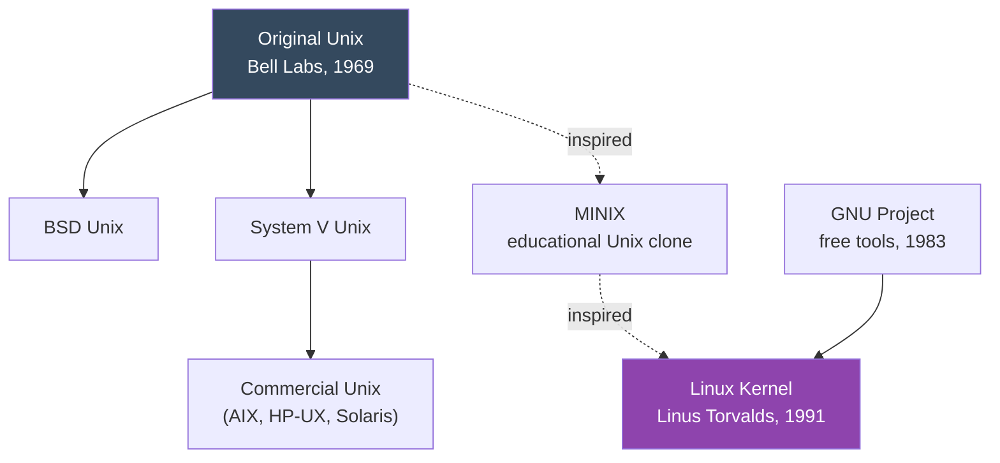

# 4. Linux vs Unix

[← Previous: Key Functions, Distributions & History](03-key-functions-distributions-history.md) | [Back to Index](README.md) | [Next: Linux Flavours →](05-linux-flavours.md)

---

## 🌳 The Family Tree

Linux is often called "Unix-like" — it follows Unix's design philosophy without containing any actual Unix source code.

**Key point:** Linux was written **from scratch**. It doesn't share code with the original Unix — it's "Unix-like" because it follows the same design ideas and standards (like POSIX), not because it's derived from Unix code.

## ⚖️ Linux vs Unix: Core Differences

| Aspect | Linux | Unix |
|---|---|---|
| **Source Code** | Open source, free to view/modify | Mostly closed/proprietary source |
| **Cost** | Free (most distros) | Usually expensive licensing |
| **Developed By** | Community + companies (Linus Torvalds started it) | AT&T Bell Labs, later various vendors |
| **Portability** | Runs on almost any hardware | Often tied to specific vendor hardware |
| **Examples** | Ubuntu, Fedora, Debian, CentOS | AIX (IBM), HP-UX (HP), Solaris (Oracle) |
| **Support Model** | Community forums + paid enterprise support | Vendor-provided support contracts |
| **Customization** | Highly customizable (many distros/desktops) | Limited, vendor-controlled |
| **Use Today** | Servers, cloud, desktops, mobile (Android), embedded | Mostly legacy enterprise systems, some servers |

## 🤝 What They Have in Common

Despite the differences, Linux and Unix share a lot of DNA:

- Both follow a similar **file system hierarchy** (root `/`, everything is a file).
- Both use a similar **command-line philosophy** (small tools that do one thing well).
- Both are **multi-user, multi-tasking** systems.
- Both largely comply with the **POSIX standard**, which defines how Unix-like systems should behave — this is *why* shell scripts and commands often work on both.

## 🧭 Simple Analogy

> Think of Unix as the **original recipe** for an operating system. Linux is a completely **new dish cooked by a different chef**, but following the same recipe philosophy — so it tastes similar and satisfies the same craving, even though not a single original ingredient was reused.

## 🔑 Key Takeaways

- Linux is **Unix-like**, not Unix itself — no shared source code, but shared design philosophy (POSIX).
- Unix today is mostly **proprietary and vendor-specific** (AIX, HP-UX, Solaris); Linux is **free and open**.
- Their similarity is *why* Linux skills transfer well to Unix systems, and vice versa.

---
[← Previous: Key Functions, Distributions & History](03-key-functions-distributions-history.md) | [Back to Index](README.md) | [Next: Linux Flavours →](05-linux-flavours.md)
