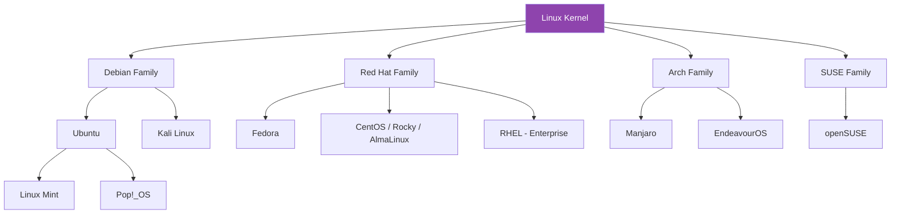
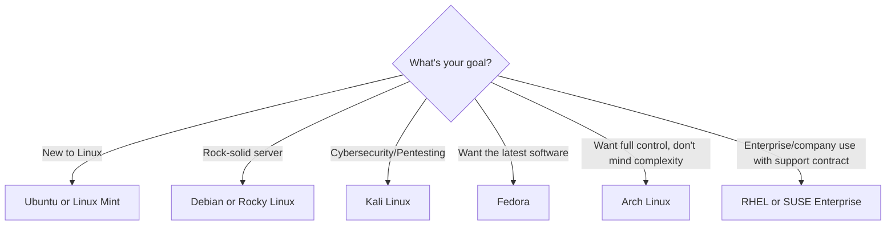

# 5. Linux Flavours (Distributions)

[← Previous: Linux vs Unix](04-linux-vs-unix.md) | [Back to Index](README.md) | [Next: Linux Flavours — Tabular Comparison →](06-linux-flavours-tabular-comparison.md)

---

## 🍦 Why So Many "Flavours"?

Since Linux is open source, anyone can take the kernel and build their own complete operating system around it. Over time, this produced hundreds of **distributions** ("distros") — each tuned for a different purpose: ease of use, servers, security, minimalism, gaming, and more.

## 🌲 The Major Distro Families

Most distributions trace back to one of a few major "parent" distros. Understanding these families helps you see how distros relate to each other.

## 🔍 Overview of Major Distributions

### 🟠 Debian Family
- **Debian** — one of the oldest, most stable distros; known for reliability.
- **Ubuntu** — Debian-based, beginner-friendly, hugely popular for desktops and servers.
- **Linux Mint** — Ubuntu-based, designed to feel familiar to Windows users.
- **Kali Linux** — Debian-based, specialized for cybersecurity and penetration testing.

### 🔴 Red Hat Family
- **Red Hat Enterprise Linux (RHEL)** — commercial, enterprise-grade, paid support.
- **Fedora** — community edition, cutting-edge features, sponsored by Red Hat.
- **CentOS / Rocky Linux / AlmaLinux** — free, RHEL-compatible, popular for servers.

### 🔵 Arch Family
- **Arch Linux** — minimal, "build it yourself," for advanced users who want full control.
- **Manjaro** — Arch-based but beginner-friendlier, with pre-configured setup.

### 🟢 SUSE Family
- **openSUSE** — community-driven, known for the YaST configuration tool.
- **SUSE Linux Enterprise** — commercial version for businesses.

## 🎯 Choosing a Distro (Rule of Thumb)

## 🔑 Key Takeaways

- All distros share the same **Linux kernel** but differ in tools, package managers, and philosophy.
- Four major families to know: **Debian, Red Hat, Arch, SUSE.**
- **Beginners** usually start with **Ubuntu** or **Linux Mint**; **servers** often use **Debian/RHEL-based** distros.
- The "best" distro depends entirely on your **goal** — there's no single right answer.

---
[← Previous: Linux vs Unix](04-linux-vs-unix.md) | [Back to Index](README.md) | [Next: Linux Flavours — Tabular Comparison →](06-linux-flavours-tabular-comparison.md)
