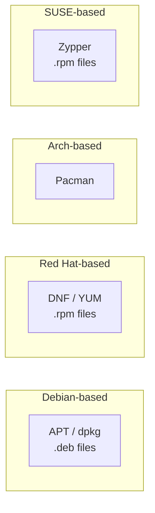

# 6. Linux Flavours — Tabular Comparison

[← Previous: Linux Flavours](05-linux-flavours.md) | [Back to Index](README.md) | [Next: Linux Users →](07-linux-users.md)

---

## 📊 Side-by-Side Distro Comparison

| Distribution | Family | Package Manager | Best For | Difficulty | Release Model |
|---|---|---|---|---|---|
| **Ubuntu** | Debian | APT (`.deb`) | Beginners, desktops, general servers | Easy | Fixed (every 6 months + LTS every 2 years) |
| **Linux Mint** | Debian/Ubuntu | APT (`.deb`) | Windows switchers, desktop use | Easy | Fixed, based on Ubuntu LTS |
| **Debian** | Debian | APT (`.deb`) | Servers, stability-critical systems | Medium | Fixed, very slow/stable release |
| **Kali Linux** | Debian | APT (`.deb`) | Cybersecurity, penetration testing | Medium–Hard | Rolling |
| **Fedora** | Red Hat | DNF (`.rpm`) | Developers, latest features | Medium | Fixed (~every 6 months) |
| **CentOS Stream / Rocky Linux** | Red Hat | DNF/YUM (`.rpm`) | Enterprise servers, free RHEL alternative | Medium | Fixed, RHEL-aligned |
| **RHEL** | Red Hat | DNF/YUM (`.rpm`) | Enterprise (paid support) | Medium | Fixed, long-term support |
| **Arch Linux** | Arch | Pacman | Advanced users wanting full control | Hard | Rolling (continuous updates) |
| **Manjaro** | Arch | Pacman | Arch power with easier setup | Medium | Rolling |
| **openSUSE** | SUSE | Zypper (`.rpm`) | Desktops & servers, YaST tool | Medium | Both (Leap = fixed, Tumbleweed = rolling) |

## 🧾 Understanding the Comparison Columns

| Column | What It Means |
|---|---|
| **Package Manager** | The tool used to install/update/remove software (like an "app store" for the command line). |
| **Difficulty** | How much Linux knowledge is assumed/required to use it comfortably. |
| **Release Model** | **Fixed** = stable, scheduled versions (e.g. "22.04"). **Rolling** = continuously updated, always latest software, but less predictable. |

## 📦 Package Managers at a Glance

**Common commands across families** (concept is the same, syntax differs):

| Task | Debian/Ubuntu (APT) | Red Hat/Fedora (DNF) | Arch (Pacman) |
|---|---|---|---|
| Install a package | `sudo apt install <pkg>` | `sudo dnf install <pkg>` | `sudo pacman -S <pkg>` |
| Update all packages | `sudo apt update && sudo apt upgrade` | `sudo dnf upgrade` | `sudo pacman -Syu` |
| Remove a package | `sudo apt remove <pkg>` | `sudo dnf remove <pkg>` | `sudo pacman -R <pkg>` |
| Search for a package | `apt search <term>` | `dnf search <term>` | `pacman -Ss <term>` |

## 🔑 Key Takeaways

- **Package manager** and **release model** are the two biggest practical differences between distros.
- **Fixed release** = predictable & stable; **rolling release** = always latest, but requires more maintenance.
- Once you know one package manager's commands, learning another distro's equivalent is quick — the concepts are identical.

---
[← Previous: Linux Flavours](05-linux-flavours.md) | [Back to Index](README.md) | [Next: Linux Users →](07-linux-users.md)
