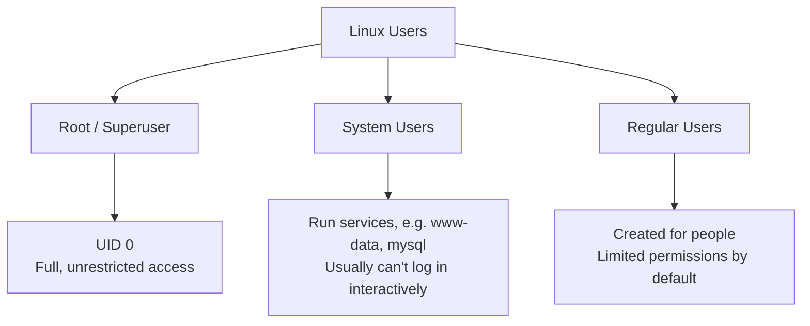
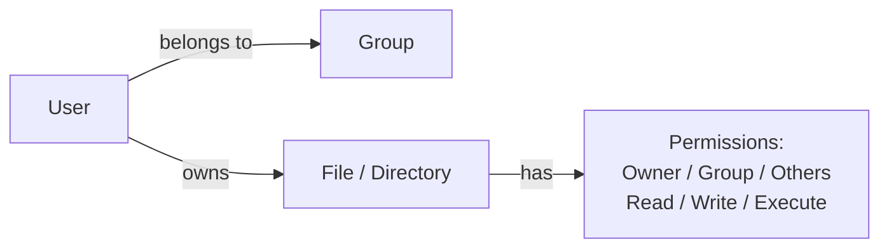

# 7. Linux Users

[← Previous: Linux Flavours — Tabular Comparison](06-linux-flavours-tabular-comparison.md) | [Back to Index](README.md) | [Next: Linux vs Windows →](08-linux-vs-windows.md)

---

## 👤 Linux Is a Multi-User System

Linux was designed from the ground up to support **many users on one machine at the same time**, each with their own permissions, home directory, and isolated environment. This is core to how Linux stays secure.

## 🧑‍🤝‍🧑 Types of Users



| User Type | Purpose | Example | Typical UID |
|---|---|---|---|
| **Root (superuser)** | Full administrative control over the whole system | `root` | `0` |
| **System users** | Run background services, not meant for humans to log in as | `www-data`, `mysql`, `sshd` | `1–999` (varies by distro) |
| **Regular users** | Everyday human accounts with limited permissions | `alex`, `priya` | `1000+` |

> ⚠️ **Why not just use root all the time?** Because root can do *anything* — including accidentally deleting critical system files. Regular users are protected by permissions, so mistakes (or malware) can't easily damage the whole system.

## 🔑 Root Access via `sudo`

Instead of logging in *as* root, most modern distros let a regular user **temporarily borrow root privileges** using `sudo` ("superuser do"):

```bash
sudo apt update        # run a single command as root
sudo -i                # start a full root shell (use with caution)
```

This is safer than being logged in as root permanently — every `sudo` command is logged, and you only get elevated privileges for that one action.

## 🗂️ Where User Info Is Stored

| File | Contains |
|---|---|
| `/etc/passwd` | List of all users, their UID, home directory, default shell |
| `/etc/shadow` | Encrypted passwords (readable only by root) |
| `/etc/group` | List of groups and which users belong to them |

## 🛠️ Common User Management Commands

| Task | Command |
|---|---|
| Add a new user | `sudo useradd -m <username>` |
| Set/change a password | `sudo passwd <username>` |
| Delete a user | `sudo userdel -r <username>` |
| Switch to another user | `su - <username>` |
| See who's currently logged in | `who` or `w` |
| Check your own username | `whoami` |
| Add a user to a group | `sudo usermod -aG <group> <username>` |

## 🔐 Users, Groups & Permissions — How They Connect



Every file has **three permission sets** — for its **owner**, its **group**, and **everyone else** — each with **read (r), write (w), execute (x)** flags. This is why running `ls -l` shows something like:

```
-rwxr-xr-- 1 alex developers 4096 Jul 8 10:00 script.sh
```

Reading this: owner (`alex`) can read/write/execute; the group (`developers`) can read/execute; everyone else can only read.

## 🔑 Key Takeaways

- Linux supports **three user types**: root, system users, and regular users.
- **`sudo`** lets regular users perform admin tasks safely, without logging in as root permanently.
- User accounts and passwords live in `/etc/passwd` and `/etc/shadow`.
- Every file's access is controlled by **owner / group / others** permissions — this is the backbone of Linux security.

---
[← Previous: Linux Flavours — Tabular Comparison](06-linux-flavours-tabular-comparison.md) | [Back to Index](README.md) | [Next: Linux vs Windows →](08-linux-vs-windows.md)
