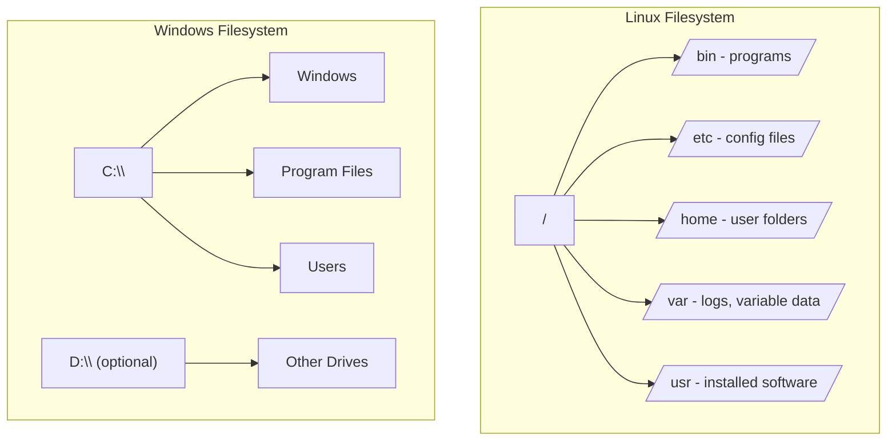
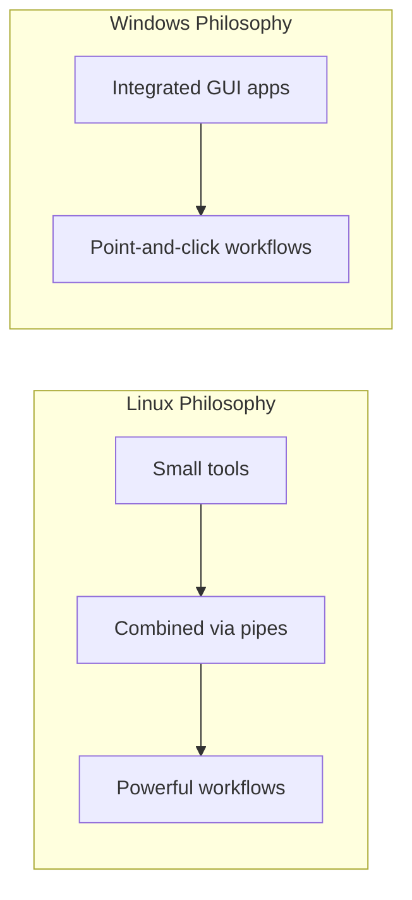

# 8. Linux vs Windows

[← Previous: Linux Users](07-linux-users.md) | [Back to Index](README.md) | [Back to Index](README.md)

---

## ⚖️ Core Differences at a Glance

| Aspect | Linux | Windows |
|---|---|---|
| **Source Code** | Open source, free to view/modify | Closed/proprietary, owned by Microsoft |
| **Cost** | Mostly free | Paid license |
| **Customization** | Highly customizable (kernel, desktop, everything) | Limited customization |
| **File System** | ext4, XFS, Btrfs (case-sensitive) | NTFS (case-insensitive by default) |
| **Path Separator** | Forward slash `/` | Backslash `\` |
| **Software Installation** | Package managers (APT, DNF, Pacman) | `.exe`/`.msi` installers, Microsoft Store |
| **User Interface** | Optional — many distros run without a GUI (servers) | GUI is core; not designed to run headless |
| **Security Model** | Permission-based, root isolated from users by default | Historically more permissive; improved with UAC |
| **Command Line** | Bash/Zsh — powerful, scriptable, central to daily use | PowerShell/CMD — improving, less central historically |
| **Common Use Case** | Servers, cloud, developers, embedded systems | Desktops, gaming, enterprise office environments |
| **Hardware Driver Support** | Improving, but sometimes limited (esp. newer/niche hardware) | Extremely broad, industry-standard driver support |
| **Updates** | Granular — update individual packages independently | Larger, more monolithic system updates |

## 🗂️ File System Structure

This is one of the most visually different aspects between the two systems.

- **Linux**: everything starts from a **single root `/`** — even other drives are *mounted into* this tree (e.g., a USB drive might appear as `/media/usb`).
- **Windows**: each drive gets its **own letter** (`C:`, `D:`, etc.) — separate trees, not one unified structure.

## 🖥️ Architecture Philosophy

Linux follows the Unix philosophy: **small, single-purpose tools combined together** (often via the command line, using pipes `|`) to accomplish complex tasks. Windows traditionally favors **integrated applications with graphical interfaces**.

## 🎯 When to Choose Which

| Scenario | Better Fit |
|---|---|
| Running a web server / cloud infrastructure | **Linux** — cheaper, more control, industry standard |
| Gaming, mainstream office software (MS Office, Adobe suite) | **Windows** — better native support |
| Learning programming / DevOps / cybersecurity | **Linux** — closer to real-world server environments |
| Corporate desktop environment with legacy software | **Windows** — broader enterprise software compatibility |
| Full control & customization down to the kernel | **Linux** |
| Widest out-of-the-box hardware/driver support | **Windows** |

## 🔑 Key Takeaways

- Linux is **open, free, and highly customizable**; Windows is **proprietary, paid, and more standardized**.
- Linux's **single unified filesystem tree** (`/`) contrasts with Windows' **drive-letter system** (`C:`, `D:`).
- Linux dominates **servers and cloud**; Windows dominates **desktop and gaming**.
- Neither is "better" universally — the right choice depends on the **use case**.

---
[← Previous: Linux Users](07-linux-users.md) | [Back to Index](README.md)

---

## 🎉 You've completed Module 3: Introduction to Linux!

You now understand what Linux is, where it came from, how it compares to Unix and Windows, the major distributions available, and how users/permissions work. This foundation prepares you for hands-on topics like the command line, file permissions in depth, and shell scripting.
