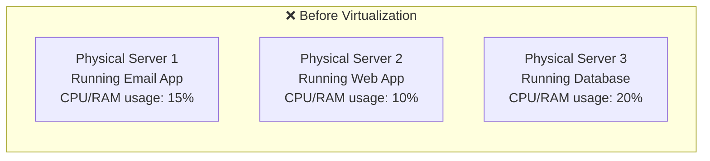
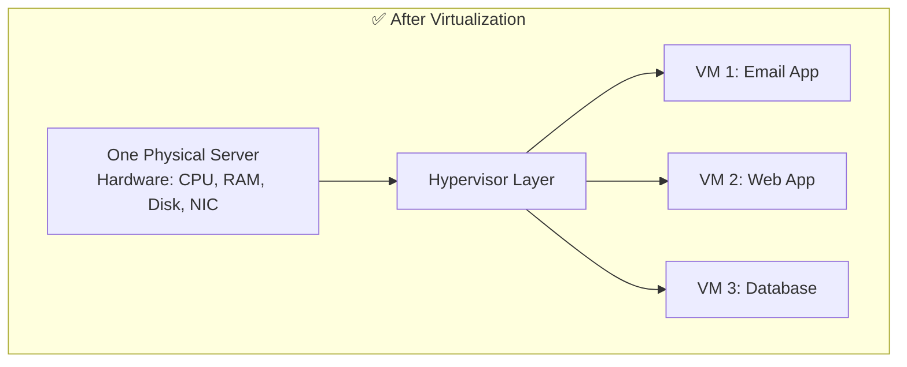
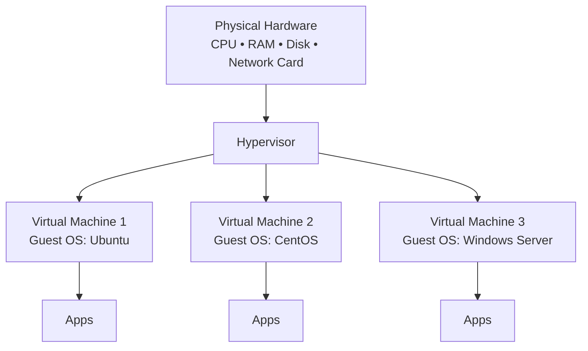
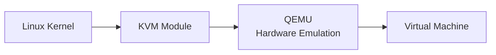

# 1. Virtualization Fundamentals

[⬅ Back to Index](./README.md) | Next: [Virtualization Types ➡](./02-virtualization-types.md)

---

## 🔹 What is Virtualization?

**Virtualization** is the technology that lets you run **multiple independent "virtual" computers on top of a single physical computer**, by creating a software-based (virtual) version of hardware — CPU, RAM, storage, network — instead of a physical one.

Each of these virtual computers is called a **Virtual Machine (VM)**, and it behaves exactly like a real, separate computer: it has its own operating system, its own applications, and its own files — even though it's actually just sharing the same physical hardware with other VMs.

> **Simple analogy:** Think of a physical server as an apartment *building*. Without virtualization, one family (one OS) occupies the whole building — wasteful. Virtualization divides the building into separate, locked apartments (VMs). Each family gets their own private space, kitchen, and door — but they all share the same building foundation, water, and electricity (the physical hardware).

---

## 🔹 Why Do We Need Virtualization?

Before virtualization became common, the standard practice was: **"1 physical server = 1 operating system = 1 application."**

This wasted huge amounts of hardware capacity — most servers sat at **10–20% utilization**, yet organizations still paid for the electricity, cooling, physical space, and hardware for each one.

Now one strong physical server can safely host all three workloads at once — each isolated from the others, each thinking it has its own dedicated machine.

---

## 🔹 Key Terminology

| Term | Meaning |
|------|---------|
| **Host Machine** | The real, physical computer that provides the actual hardware resources |
| **Guest OS** | The operating system running *inside* a virtual machine |
| **Hypervisor (VMM)** | The software layer that creates and manages virtual machines, allocating hardware to each one |
| **Virtual Machine (VM)** | A software-emulated computer with its own virtual CPU, RAM, disk, and network |
| **Virtual Disk** | A file on the host (e.g. `.vdi`, `.vmdk`, `.qcow2`) that acts as the VM's hard drive |
| **Snapshot** | A saved state of a VM at a point in time, so you can roll back instantly |
| **Migration** | Moving a running VM from one physical host to another, often with zero downtime |
| **Provisioning** | The process of creating and configuring a new VM |

---

## 🔹 The Virtualization Architecture

The **hypervisor** is the heart of virtualization. It sits between the physical hardware and the virtual machines, and its job is to:

1. **Allocate** physical CPU/RAM/disk slices to each VM
2. **Isolate** VMs from each other (a crash in VM1 doesn't affect VM2)
3. **Schedule** which VM gets CPU time at any given moment
4. **Emulate** virtual hardware devices (virtual NIC, virtual disk controller, etc.) that the guest OS talks to

---

## 🔹 Benefits of Virtualization

| Benefit | Explanation |
|---------|-------------|
| 💰 **Cost savings** | Fewer physical machines = less hardware, power, cooling, and rack space |
| 🧱 **Isolation** | A problem inside one VM (crash, malware, misconfiguration) doesn't affect others |
| 📈 **Scalability** | Spin up a new VM in minutes instead of buying and racking new hardware |
| 🧪 **Safe testing** | Test risky changes, patches, or new OS versions in a disposable VM |
| ⏪ **Fast recovery** | Snapshots let you roll back to a known-good state instantly |
| 🚚 **Easy migration** | VMs can be moved between physical hosts, even live, with minimal downtime |
| 🌍 **Better resource usage** | Physical hardware utilization jumps from ~15% to 60–80% |

---

## 🔹 Where Does Linux Fit In?

Linux plays a central role in virtualization in two ways:

1. **As a host** — Linux itself has a built-in hypervisor called **KVM (Kernel-based Virtual Machine)**, turning the Linux kernel into a Type 1 hypervisor. This powers a large share of the world's cloud infrastructure, including much of AWS, Google Cloud, and OpenStack.
2. **As a guest** — Linux distributions (Ubuntu, CentOS, Debian, etc.) are among the most common operating systems installed *inside* virtual machines, because they're free, lightweight, and scriptable.

---

## 🔹 Real-World Use Cases

- **Data centers** — consolidating hundreds of physical servers into virtualized clusters
- **Software development & testing** — spinning up disposable environments to test code
- **Disaster recovery** — replicating VMs to a secondary site for failover
- **Cloud computing** — the entire public cloud (AWS, Azure, GCP) is built on virtualization
- **Legacy application support** — running an old OS a modern app still depends on, without keeping old hardware alive

---

## 🧠 Quick Knowledge Check

1. What is the difference between a Host and a Guest?

The Host is the real physical machine providing hardware. The Guest is the operating system running inside a virtual machine on top of that hardware.

2. Why was pre-virtualization server usage so inefficient?

Because each physical server typically ran only one OS/application, leaving most CPU and RAM (often 80%+) unused.

3. What Linux technology turns the kernel itself into a hypervisor?

KVM — Kernel-based Virtual Machine.

---

## ✅ Key Takeaways

- Virtualization creates multiple isolated virtual computers on one physical machine
- The **hypervisor** is the software that makes this possible
- Main benefits: cost savings, isolation, scalability, fast recovery
- Linux (via **KVM**) is one of the most widely used hypervisor technologies in the world

---

[⬅ Back to Index](./README.md) | Next: [Virtualization Types ➡](./02-virtualization-types.md)
