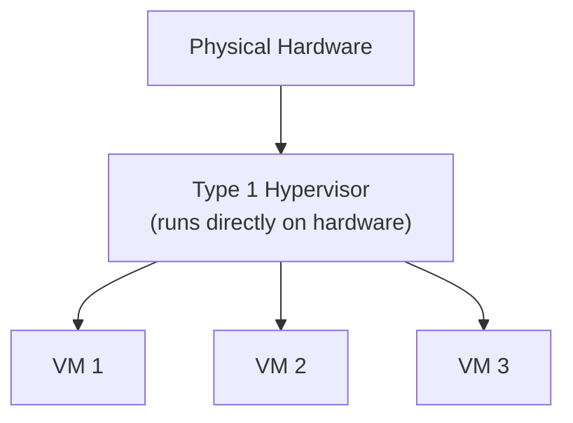
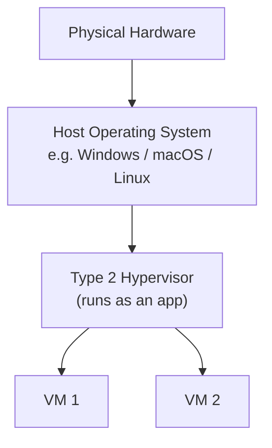
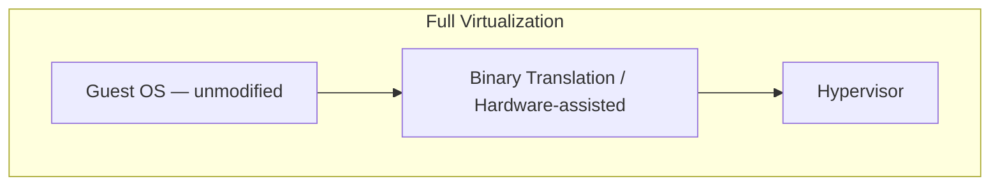
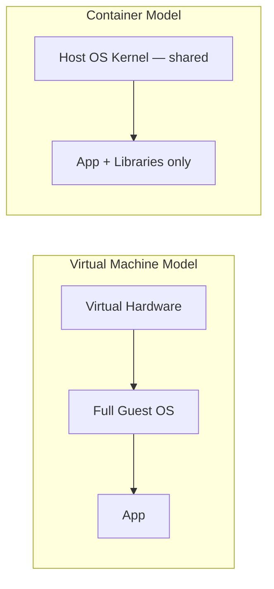
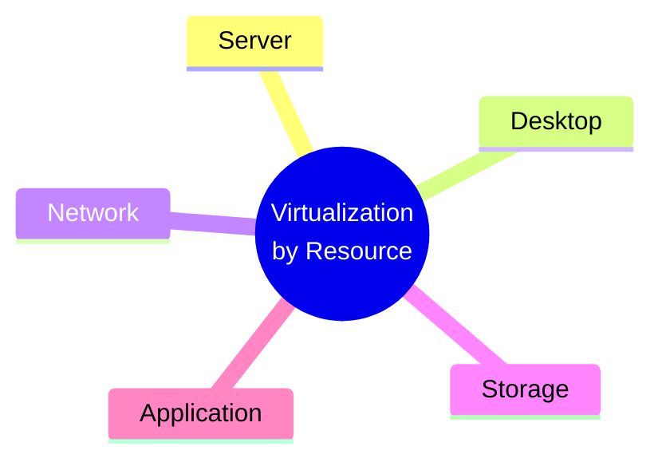
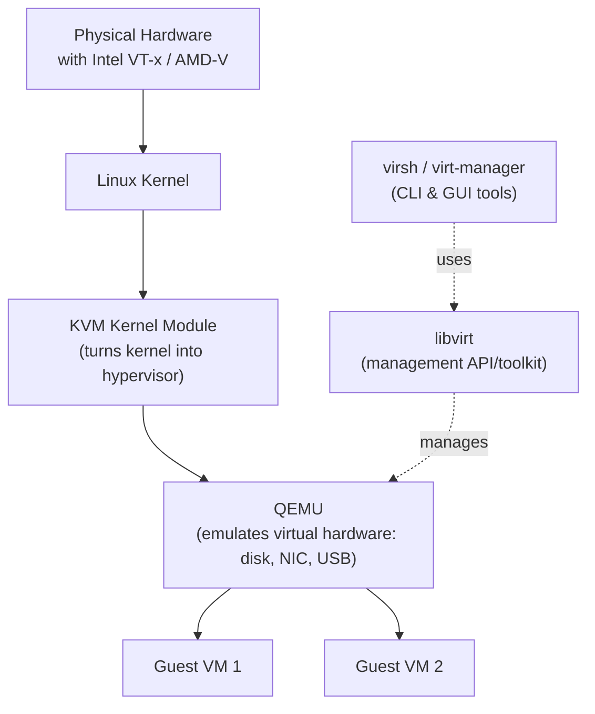

# 2. Virtualization Types

[⬅ Previous: Virtualization Fundamentals](./01-virtualization-fundamentals.md) | [🏠 Index](./README.md) | Next: [VirtualBox Practical Lab ➡](./03-virtualbox-practical-lab.md)

---

Virtualization can be classified in **two different ways**:

1. **By Hypervisor Type** — *how* the virtualization software sits on the hardware
2. **By Resource Type** — *what* is being virtualized (servers, desktops, networks, storage, apps)

---

## 🔹 Part A: Hypervisor Types

### Type 1 — Bare-Metal Hypervisor

Installed **directly on the physical hardware**, with no underlying OS. The hypervisor *is* the OS.



**Examples:** VMware ESXi, Microsoft Hyper-V, Citrix XenServer, Linux **KVM**

**Used for:** Production data centers, enterprise servers, cloud platforms — anywhere performance and stability matter most.

**Why it's faster:** There's no host OS competing for resources — the hypervisor talks to the hardware directly.

---

### Type 2 — Hosted Hypervisor

Installed **as an application on top of a regular operating system** (Windows, macOS, Linux).



**Examples:** Oracle **VirtualBox**, VMware Workstation/Fusion, Parallels Desktop

**Used for:** Personal learning, development, testing, running a second OS on your laptop — exactly what we'll do in the next chapter.

**Trade-off:** Slightly slower than Type 1, because it must go through the host OS to reach hardware — but far easier to install and use.

### Type 1 vs Type 2 — Quick Comparison

| Aspect | Type 1 (Bare-Metal) | Type 2 (Hosted) |
|--------|----------------------|------------------|
| Runs on | Hardware directly | On top of a host OS |
| Performance | Higher (near-native) | Lower (extra OS layer) |
| Typical use | Data centers, cloud, production | Personal labs, testing, learning |
| Examples | ESXi, Hyper-V, KVM, Xen | VirtualBox, VMware Workstation |
| Installation | More complex | Very easy |

---

## 🔹 Part B: Virtualization Approaches (How the Guest OS is Tricked)



| Approach | How it works | Guest OS needs modification? | Example |
|----------|---------------|-------------------------------|---------|
| **Full Virtualization** | Hypervisor fully emulates hardware; guest OS runs unmodified, unaware it's virtualized | ❌ No | VMware ESXi, VirtualBox |
| **Para-virtualization** | Guest OS is modified to make special calls directly to the hypervisor for better performance | ✅ Yes | Older Xen setups |
| **OS-level Virtualization (Containers)** | No separate guest OS at all — containers share the host's kernel but stay isolated in their own namespace | N/A (no full guest OS) | Docker, LXC |



> 💡 We cover this comparison in much more depth in [`05-containers-vs-virtual-machines.md`](./05-containers-vs-virtual-machines.md).

---

## 🔹 Part C: Virtualization by Resource Type

| Type | What's virtualized | Real-world example |
|------|---------------------|----------------------|
| **Server Virtualization** | A physical server split into multiple virtual servers | Running 5 VMs on one physical server with ESXi |
| **Desktop Virtualization** | A full desktop OS delivered remotely to end-users | VDI (Virtual Desktop Infrastructure) via Citrix/VMware Horizon |
| **Network Virtualization** | Physical network resources abstracted into virtual networks | Software-Defined Networking (SDN), VLANs, virtual switches |
| **Storage Virtualization** | Multiple physical storage devices pooled into one logical unit | SAN/NAS pooling, AWS EBS |
| **Application Virtualization** | An app runs in an isolated bubble without being "installed" on the OS | Running an app via a streamed container/sandbox |



---

## 🔹 Deep Dive: KVM — Linux's Native Hypervisor

Since this guide is Linux-focused, KVM deserves special attention. KVM converts the Linux kernel into a Type 1 hypervisor, and is the technology behind much of the public cloud.



- **KVM** = the kernel module that provides the core virtualization capability (requires CPU support: Intel VT-x or AMD-V)
- **QEMU** = handles hardware emulation (virtual disks, network cards, etc.) working alongside KVM
- **libvirt** = a management layer/API that tools use to create and control VMs
- **virt-manager / virsh** = the GUI and command-line tools admins actually use day-to-day

Check if your Linux CPU supports hardware virtualization:

```bash
egrep -c '(vmx|svm)' /proc/cpuinfo
# vmx = Intel VT-x, svm = AMD-V
# A result greater than 0 means virtualization is supported
```

---

## 🧠 Quick Knowledge Check

<details>
<summary>1. Which hypervisor type is generally used in production data centers, and why?</summary>
Type 1 (bare-metal), because it runs directly on hardware with no host OS overhead, giving near-native performance.
</details>

<details>
<summary>2. What's the main structural difference between a VM and a container?</summary>
A VM includes a full separate guest OS on virtual hardware; a container shares the host's kernel and only packages the app plus its libraries — making it much lighter.
</details>

<details>
<summary>3. What three components work together to make KVM-based virtualization function?</summary>
KVM (kernel module), QEMU (hardware emulation), and libvirt (management layer).
</details>

---

## ✅ Key Takeaways

- **Type 1** hypervisors run on bare metal (production); **Type 2** run on top of a host OS (learning/testing)
- **Full virtualization** emulates hardware for an unmodified guest OS — this is what VirtualBox and most modern hypervisors use
- Virtualization also applies to **networks, storage, desktops, and apps** — not just servers
- **KVM** is Linux's native hypervisor and powers much of the modern cloud

---

[⬅ Previous: Virtualization Fundamentals](./01-virtualization-fundamentals.md) | [🏠 Index](./README.md) | Next: [VirtualBox Practical Lab ➡](./03-virtualbox-practical-lab.md)
