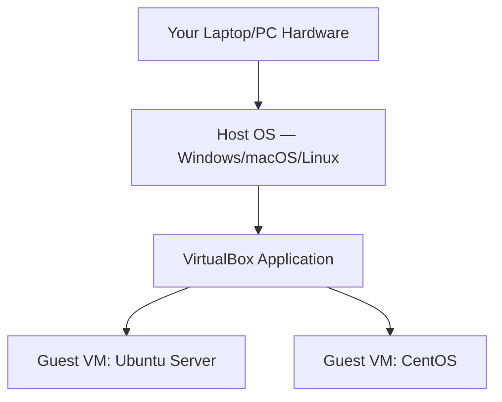
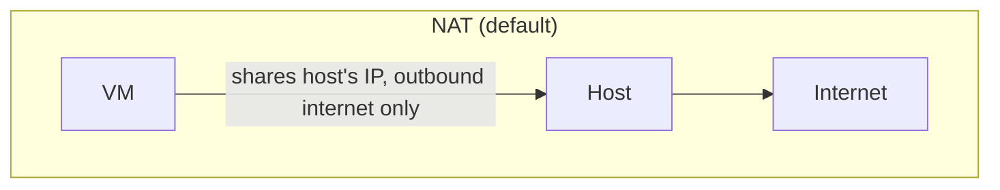
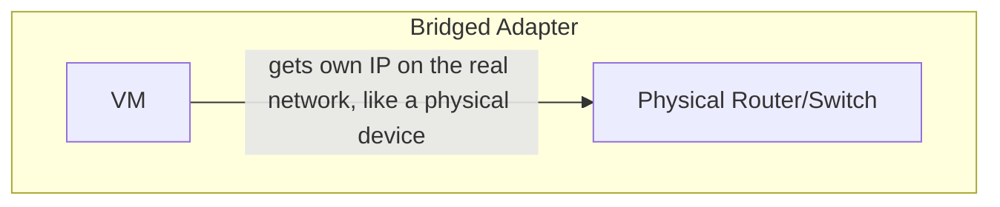
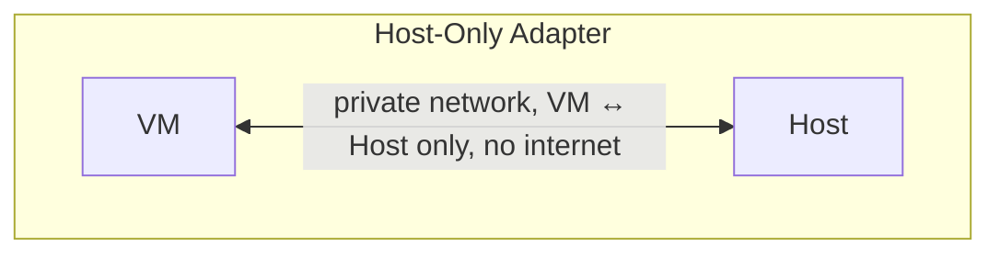

# 3. VirtualBox — Practical Lab

[⬅ Previous: Virtualization Types](./02-virtualization-types.md) | [🏠 Index](./README.md) | Next: [AWS Virtualization ➡](./04-aws-virtualization.md)

---

## 🔹 What is VirtualBox?

**Oracle VirtualBox** is a free, open-source **Type 2 (hosted) hypervisor** that runs on Windows, macOS, and Linux. It's the most popular tool for learning virtualization because it's free, lightweight, and lets you safely experiment without touching real hardware.



---

## 🔹 Step 1: Installing VirtualBox

### On Ubuntu / Debian
```bash
sudo apt update
sudo apt install virtualbox virtualbox-ext-pack -y
```

### On RHEL / CentOS / Fedora
```bash
sudo dnf install @development-tools
sudo dnf install VirtualBox -y
```

### On Windows / macOS
Download the installer directly from: `https://www.virtualbox.org/wiki/Downloads` and run it like any normal application.

> ⚠️ Before installing, make sure hardware virtualization (Intel VT-x / AMD-V) is **enabled in your BIOS/UEFI settings** — otherwise VMs will fail to start or run extremely slowly.

---

## 🔹 Step 2: Creating Your First Virtual Machine

1. Open VirtualBox → click **New**
2. Give it a name (e.g. `Ubuntu-Lab-01`) and select **Type: Linux**, **Version: Ubuntu (64-bit)**
3. Allocate **RAM** (2048–4096 MB recommended for a server install)
4. Create a **Virtual Hard Disk** — choose **VDI**, dynamically allocated, 20–25 GB
5. Go to **Settings → Storage** → attach your Ubuntu Server `.iso` file to the virtual optical drive
6. Click **Start** — the VM boots from the ISO and begins the OS installer, exactly like installing on a real machine


---

## 🔹 Step 3: Understanding VirtualBox Networking Modes

This is the part most beginners find confusing — but it's simple once visualized.







| Mode | Internet Access? | Visible on LAN? | Best for |
|------|--------------------|-------------------|----------|
| **NAT** | ✅ Yes (outbound only) | ❌ No | Quick internet access, default choice |
| **Bridged** | ✅ Yes | ✅ Yes — VM acts like a real device on your network | Hosting a service others need to reach |
| **Host-Only** | ❌ No | Only visible to the host | Isolated internal labs, VM-to-VM/VM-to-host testing |
| **Internal Network** | ❌ No | Only visible to other VMs in same internal network | Multi-VM labs completely isolated from host and internet |

---

## 🔹 Step 4: Snapshots — Your Safety Net

A snapshot freezes the exact state of a VM (disk + RAM) so you can return to it anytime.

```bash
# Take a snapshot via CLI
VBoxManage snapshot "Ubuntu-Lab-01" take "clean-install" --description "Fresh OS, before any changes"

# List all snapshots
VBoxManage snapshot "Ubuntu-Lab-01" list

# Restore to a snapshot
VBoxManage snapshot "Ubuntu-Lab-01" restore "clean-install"
```

**Why this matters:** Before trying something risky (a system update, a config change, testing malware in isolation), take a snapshot first. If anything breaks, roll back in seconds — no need to reinstall the whole OS.

---

## 🔹 Step 5: Shared Folders

Shared folders let your VM access a folder from your real (host) machine.

1. VM Settings → **Shared Folders** → Add
2. Choose a host folder path, give it a name, tick **Auto-mount**
3. Inside the guest Linux VM:
```bash
sudo apt install virtualbox-guest-utils -y
sudo usermod -aG vboxsf $USER
# Log out and back in — the shared folder now appears under /media/sf_<foldername>
```

---

## 🔹 VBoxManage — Essential CLI Commands

`VBoxManage` lets you control VirtualBox entirely from the terminal — useful for scripting and automation.

```bash
VBoxManage list vms                          # List all VMs
VBoxManage list runningvms                   # List only running VMs
VBoxManage startvm "Ubuntu-Lab-01" --type headless   # Start without GUI
VBoxManage controlvm "Ubuntu-Lab-01" poweroff         # Force power off
VBoxManage controlvm "Ubuntu-Lab-01" acpipowerbutton  # Graceful shutdown
VBoxManage modifyvm "Ubuntu-Lab-01" --memory 4096     # Change RAM
VBoxManage showvminfo "Ubuntu-Lab-01"                 # Show VM details
```

---

## 🔹 Hands-On Exercise: Build a 2-VM Private Lab

**Goal:** Create two Ubuntu VMs on a Host-Only network and confirm they can talk to each other.

1. Create `VM-A` and `VM-B`, both set to **Host-Only Adapter**
2. Boot both, run `ip a` on each to note their assigned IPs (e.g. `192.168.56.10`, `192.168.56.11`)
3. From `VM-A`, test connectivity:
```bash
ping 192.168.56.11
```
4. ✅ If you get replies, your isolated lab network is working — this is exactly how real test/staging environments are built before touching production.

---

## 🔹 Common Troubleshooting

| Problem | Likely Cause | Fix |
|---------|---------------|-----|
| VM won't start / "VT-x not available" | Virtualization disabled in BIOS | Enable Intel VT-x / AMD-V in BIOS/UEFI |
| No internet inside VM | Wrong network adapter mode | Switch to NAT or Bridged |
| Very slow VM performance | Too little RAM/CPU allocated, or no Guest Additions installed | Increase RAM/CPU, install Guest Additions |
| Can't resize VM window / low resolution | Guest Additions not installed | Devices → Insert Guest Additions CD image → install inside guest |

---

## ✅ Key Takeaways

- VirtualBox is a **Type 2 hypervisor** — perfect for local learning and labs
- Understanding **networking modes** (NAT, Bridged, Host-Only, Internal) is essential and frequently misunderstood
- **Snapshots** are your best friend for safe experimentation
- `VBoxManage` lets you fully automate and script VM management

---

[⬅ Previous: Virtualization Types](./02-virtualization-types.md) | [🏠 Index](./README.md) | Next: [AWS Virtualization ➡](./04-aws-virtualization.md)
