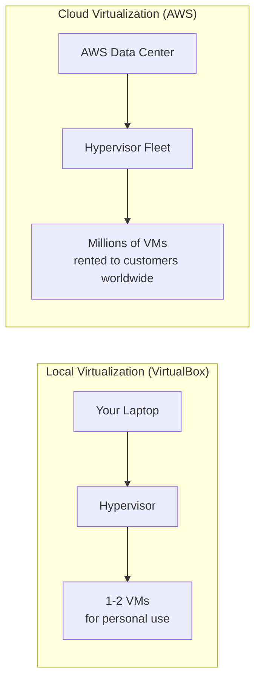
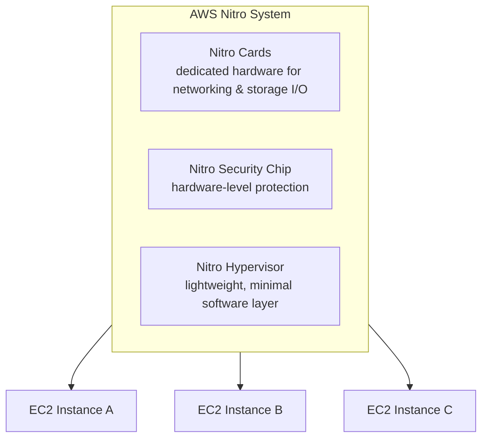
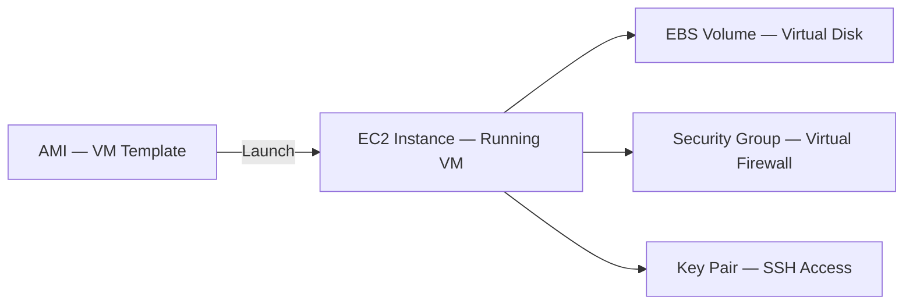
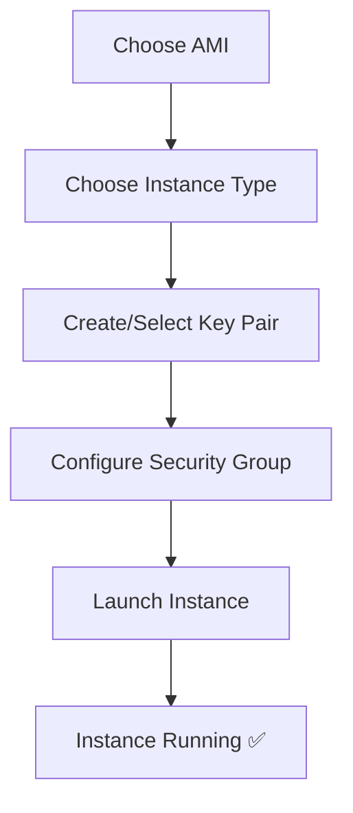
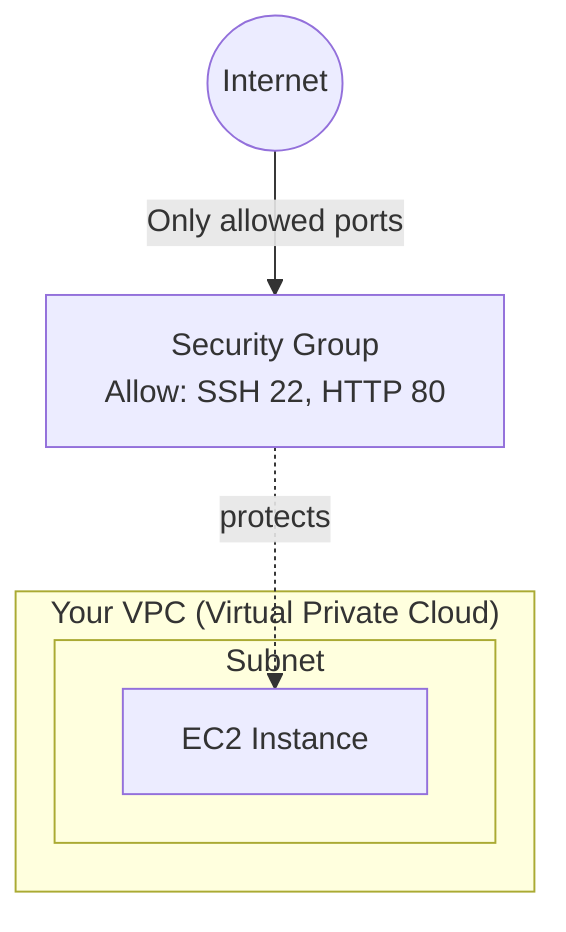

# 4. AWS Virtualization

[⬅ Previous: VirtualBox Practical Lab](./03-virtualbox-practical-lab.md) | [🏠 Index](./README.md) | Next: [Containers vs VMs ➡](./05-containers-vs-virtual-machines.md)

---

## 🔹 From Local Virtualization to Cloud Virtualization

Everything covered in the VirtualBox chapter happens on **your own laptop**. AWS takes the exact same core idea — a hypervisor slicing physical hardware into virtual machines — and runs it at **massive, global scale**, renting out those virtual machines to millions of customers on demand.



| Aspect | Local (VirtualBox) | Cloud (AWS) |
|--------|----------------------|--------------|
| Hardware ownership | You own it | AWS owns it |
| Scale | 1 machine, a few VMs | Global data centers, millions of VMs |
| Payment | One-time (your hardware) | Pay-as-you-go (per second/hour) |
| Access | Local only | Accessible from anywhere via internet |
| Elasticity | Fixed capacity | Scale up/down instantly |

---

## 🔹 The AWS Nitro System

AWS originally used a **customized Xen hypervisor** (a Type 1 bare-metal hypervisor). Today, most EC2 instances run on the **AWS Nitro System** — AWS's next-generation virtualization platform.



**Why Nitro matters:** By offloading networking, storage, and security to dedicated hardware cards instead of software, the hypervisor itself becomes extremely thin — giving virtual machines performance nearly identical to bare-metal servers.

---

## 🔹 Core Concepts: EC2 and AMI

| AWS Term | Equivalent to (from VirtualBox chapter) |
|----------|-------------------------------------------|
| **EC2 Instance** | A running Virtual Machine |
| **AMI (Amazon Machine Image)** | A VM template/snapshot used to launch new instances (like a pre-made `.iso` + saved configuration) |
| **Instance Type** (e.g. `t2.micro`) | The VM's allocated RAM/CPU/network profile |
| **Security Group** | A virtual firewall controlling inbound/outbound traffic |
| **EBS Volume** | A virtual hard disk attached to the instance |
| **Key Pair** | SSH credentials used to securely log in, instead of a password |



---

## 🔹 EC2 Instance Types (Overview)

| Family | Optimized for | Example use case |
|--------|----------------|---------------------|
| **General Purpose** (`t3`, `m5`) | Balanced CPU/RAM | Web servers, small apps |
| **Compute Optimized** (`c5`) | High CPU performance | Batch processing, gaming servers |
| **Memory Optimized** (`r5`) | High RAM | In-memory databases, caching |
| **Storage Optimized** (`i3`) | Fast, high-volume disk I/O | Data warehousing, big data |

---

## 🔹 Step-by-Step: Launch Your First EC2 Instance (Free Tier)

1. Log in to the **AWS Console** → search **EC2** → click **Launch Instance**
2. **Name** your instance (e.g. `my-first-linux-vm`)
3. Choose an **AMI**: select **Amazon Linux 2023** or **Ubuntu Server 22.04** (both Free Tier eligible)
4. Choose **Instance Type**: `t2.micro` (Free Tier eligible)
5. **Key pair**: create a new key pair, download the `.pem` file, and keep it safe — you cannot re-download it later
6. **Network settings**: allow **SSH (port 22)** from your IP
7. Click **Launch Instance**



### Connect via SSH
```bash
chmod 400 my-key.pem
ssh -i "my-key.pem" ec2-user@<your-instance-public-ip>
```

### Stop it when you're done (avoid charges!)
```bash
# Using AWS CLI
aws ec2 stop-instances --instance-ids i-xxxxxxxxxxxxxxxxx
```

> ⚠️ Always **stop or terminate** instances you're not using — Free Tier has monthly limits, and running instances 24/7 beyond that limit will incur charges.

---

## 🔹 Storage Virtualization in AWS: EBS vs Instance Store

| Type | Persistence | Speed | Use case |
|------|--------------|-------|----------|
| **EBS (Elastic Block Store)** | Persists after instance stop/terminate (if configured) | Good, network-attached | Default choice — OS disks, databases |
| **Instance Store** | Lost when instance stops | Very fast, physically attached | Temporary/cache data only |

---

## 🔹 Network Virtualization in AWS: Security Groups & VPC

- A **VPC (Virtual Private Cloud)** is your own logically isolated virtual network within AWS — the cloud equivalent of the Host-Only/Internal networks you built in VirtualBox
- A **Security Group** acts as a virtual firewall attached to each instance, controlling exactly which ports/IPs can reach it



---

## 🧠 Quick Knowledge Check

<details>
<summary>1. What AWS component replaced much of the traditional software hypervisor for performance reasons?</summary>
The AWS Nitro System — it offloads networking, storage, and security to dedicated hardware cards, leaving a very thin hypervisor layer.
</details>

<details>
<summary>2. What is the cloud equivalent of the ISO file you attach when creating a VirtualBox VM?</summary>
An AMI (Amazon Machine Image) — the template used to launch a new EC2 instance.
</details>

<details>
<summary>3. What should you always do with EC2 instances you're not actively using?</summary>
Stop or terminate them, to avoid unnecessary charges — especially important within the Free Tier's usage limits.
</details>

---

## ✅ Key Takeaways

- AWS applies the same virtualization principles as VirtualBox, but at massive global scale
- The **Nitro System** is AWS's modern, hardware-accelerated virtualization platform
- **EC2 = VM**, **AMI = VM template**, **Security Group = virtual firewall**, **EBS = virtual disk**
- Always stop/terminate unused instances to control cost

---

[⬅ Previous: VirtualBox Practical Lab](./03-virtualbox-practical-lab.md) | [🏠 Index](./README.md) | Next: [Containers vs VMs ➡](./05-containers-vs-virtual-machines.md)
