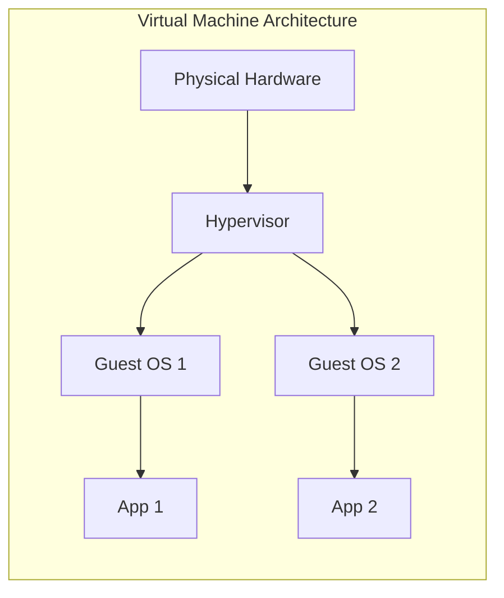
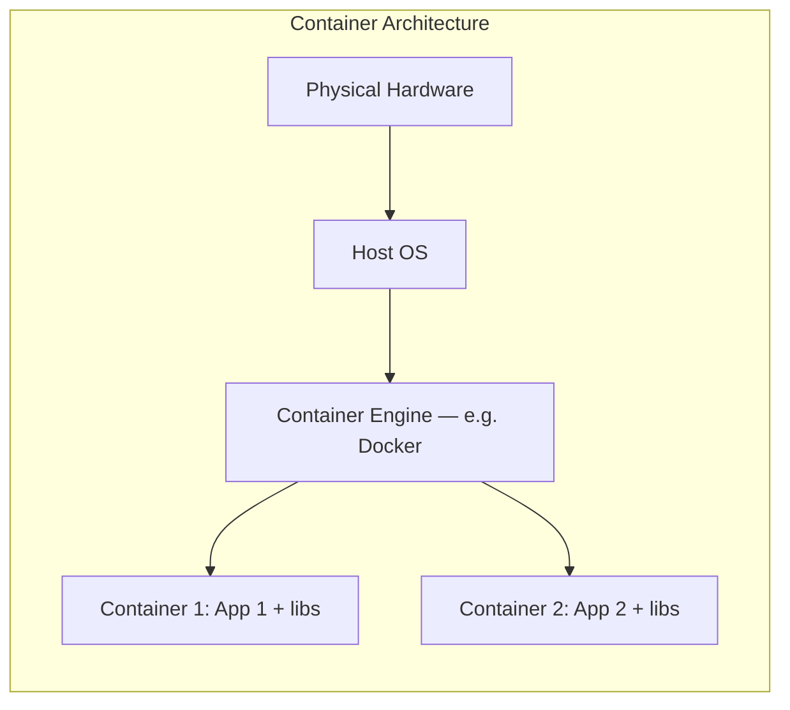
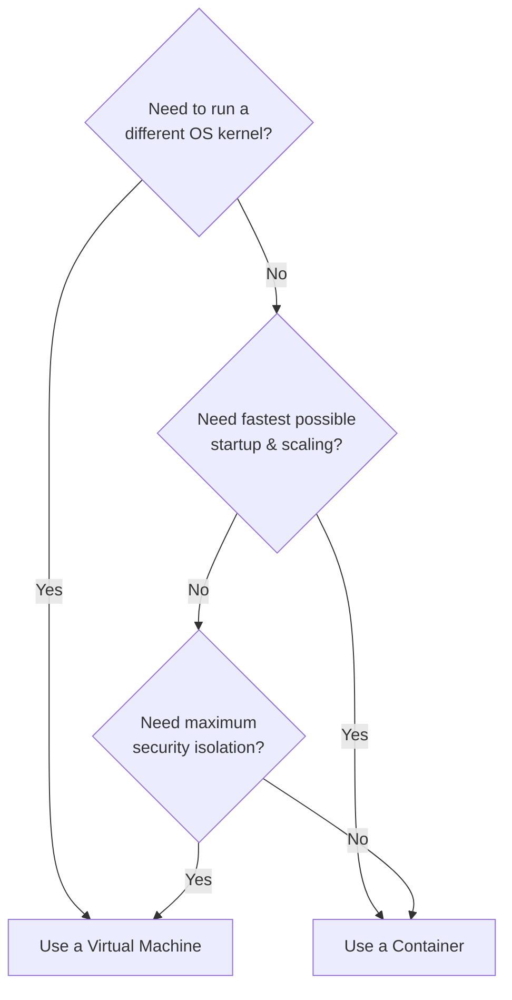
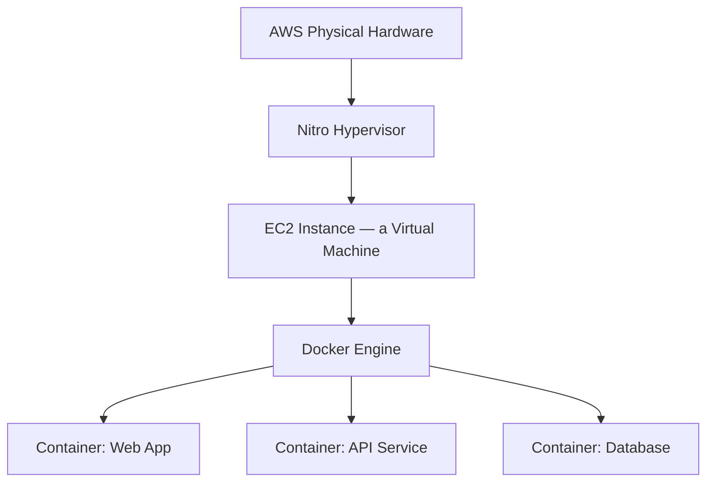

# 5. Containers vs Virtual Machines (Bonus Topic)

[⬅ Previous: AWS Virtualization](./04-aws-virtualization.md) | [🏠 Index](./README.md) | Next: [Cheat Sheet & Practice ➡](./06-cheat-sheet-and-practice.md)

> 💡 This topic wasn't in the original 5 lectures, but it's essential to fully understand modern virtualization — most real-world Linux/DevOps roles use both VMs **and** containers together.

---

## 🔹 Why Compare Them?

Both VMs and containers solve a similar problem — **running isolated workloads on shared hardware** — but they do it in fundamentally different ways.

**The key difference:** every VM carries its own full guest operating system (kernel included). Containers **share the host's kernel** and only package the application plus the specific libraries it needs — making them dramatically smaller and faster.

---

## 🔹 Side-by-Side Comparison

| Aspect | Virtual Machine | Container |
|--------|-------------------|-----------|
| **Isolation level** | Full (separate kernel) — very strong | Process-level (shared kernel) — good, but less strict |
| **Boot time** | Minutes | Seconds (often < 1 second) |
| **Size** | GBs (full OS included) | MBs (just app + libraries) |
| **Performance overhead** | Higher | Very low, near-native |
| **Portability** | Less portable (large images) | Highly portable (`docker run` anywhere) |
| **Best for** | Running different OS kernels, strong isolation needs, legacy apps | Microservices, CI/CD, fast scaling, cloud-native apps |
| **Common tools** | VirtualBox, VMware, KVM, Hyper-V | Docker, Podman, LXC |

---

## 🔹 When to Use Which

- **Choose a VM when:** you need to run a completely different OS, need the strongest possible isolation (e.g. multi-tenant hosting, security-sensitive workloads), or are running legacy software tied to a specific kernel
- **Choose a container when:** you're deploying modern applications, need to scale quickly, want consistent "works on my machine → works everywhere" behavior, or are building microservices/CI-CD pipelines

---

## 🔹 They Often Work Together

In the real world, it's rarely "VMs vs containers" — it's usually **VMs running containers inside them**. For example, an AWS EC2 instance (a VM) very commonly runs Docker (containers) on top of it.

This gives you the **strong security boundary of a VM** at the outer layer, plus the **speed and efficiency of containers** for the actual application workloads inside it.

---

## ✅ Key Takeaways

- VMs virtualize **hardware** (full OS each); containers virtualize the **OS** (share the host kernel)
- Containers are faster and lighter; VMs offer stronger isolation
- Modern infrastructure typically combines both: **VMs for isolation, containers for agility**

---

[⬅ Previous: AWS Virtualization](./04-aws-virtualization.md) | [🏠 Index](./README.md) | Next: [Cheat Sheet & Practice ➡](./06-cheat-sheet-and-practice.md)
