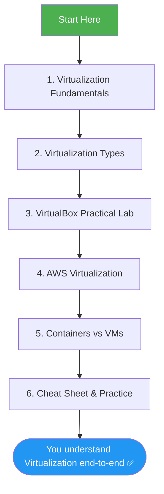

# 🐧 Linux Virtualization — Complete Practical Guide

A clean, beginner-friendly, diagram-backed set of notes covering **Virtualization** — from core theory to hands-on labs in **VirtualBox** and **AWS**. Built while studying *Module 4: Virtualization* and expanded with extra concepts so nothing important is left out.

> 📌 Every file is self-contained. Read them in order if you're new to the topic, or jump straight to the one you need.

---

## 📖 Table of Contents

| # | Topic | File | What you'll learn |
|---|-------|------|--------------------|
| 1 | Virtualization Fundamentals | [`01-virtualization-fundamentals.md`](./01-virtualization-fundamentals.md) | What virtualization is, why it exists, key terms, architecture |
| 2 | Virtualization Types | [`02-virtualization-types.md`](./02-virtualization-types.md) | Type 1 vs Type 2 hypervisors, full/para/OS-level virtualization, KVM |
| 3 | VirtualBox Practical Lab | [`03-virtualbox-practical-lab.md`](./03-virtualbox-practical-lab.md) | Install VirtualBox, create a VM, networking modes, snapshots, CLI |
| 4 | AWS Virtualization | [`04-aws-virtualization.md`](./04-aws-virtualization.md) | Cloud virtualization, AWS Nitro, EC2, AMIs, launching an instance |
| 5 | Containers vs VMs *(bonus)* | [`05-containers-vs-virtual-machines.md`](./05-containers-vs-virtual-machines.md) | Docker vs VMs, when to use which |
| 6 | Cheat Sheet & Practice *(bonus)* | [`06-cheat-sheet-and-practice.md`](./06-cheat-sheet-and-practice.md) | Commands quick-reference + quiz to test yourself |

---

## 🗺️ Learning Roadmap

---

## 🎯 Who this is for

- Students learning **Linux system administration** or **DevOps**
- Anyone preparing for **RHCSA**, **CompTIA Linux+**, or **AWS Cloud Practitioner**
- Beginners who want to understand virtualization *by doing*, not just reading theory

## ✅ Prerequisites

- A computer with at least 8 GB RAM (4 GB minimum) and virtualization support (Intel VT-x / AMD-V) enabled in BIOS
- Basic comfort with the Linux terminal (`cd`, `ls`, `sudo`)
- A free [AWS account](https://aws.amazon.com/free/) for the cloud chapter (optional but recommended)

## 🛠️ Tools used in this guide

| Tool | Purpose |
|------|---------|
| Oracle VirtualBox | Free, cross-platform Type 2 hypervisor for local labs |
| Ubuntu Server ISO | The guest OS we install inside VirtualBox |
| AWS Free Tier | Real cloud virtualization practice |
| Mermaid diagrams | All diagrams in this repo render natively on GitHub — no external images needed |

---

### 📚 Original course reference

These notes are based on **Module 4: Virtualization** (1h 6m, 7 lectures) and expand on it with additional industry-standard concepts (containers, KVM internals, cheat sheets) that are commonly expected alongside this topic.

---

⭐ If this helped you, consider starring the repo — it helps others find it too.
