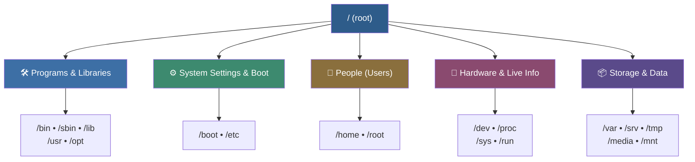
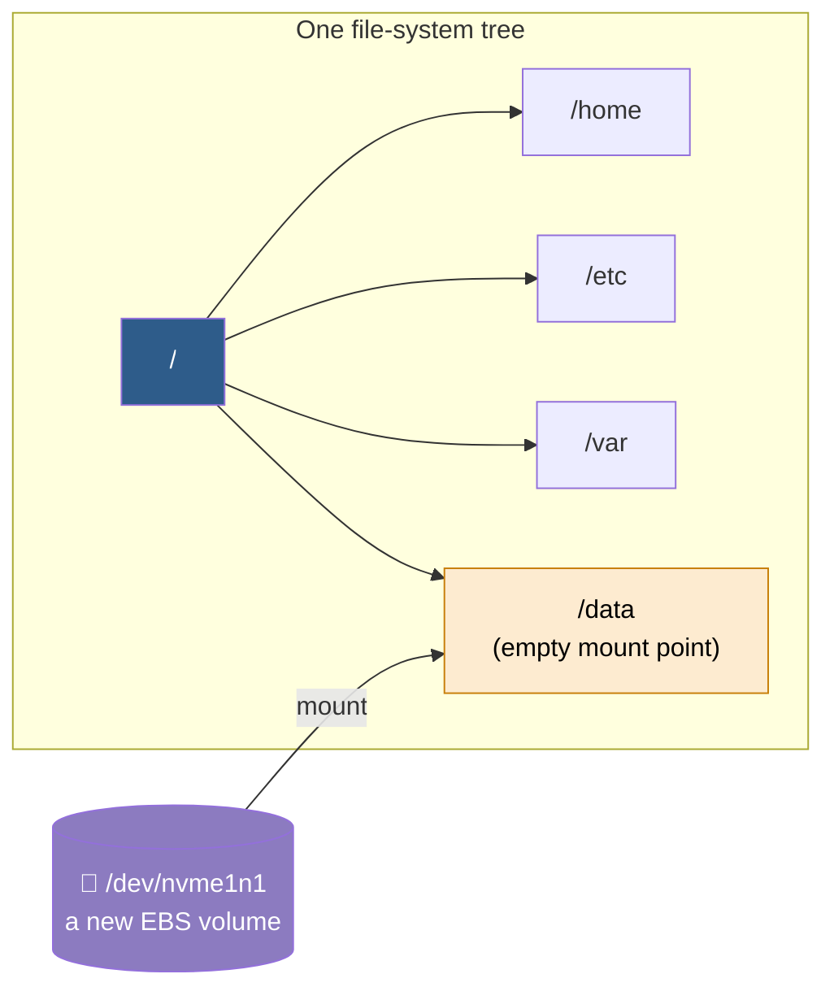
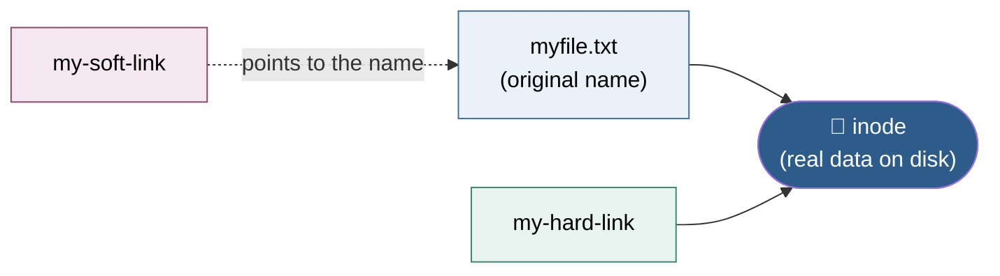

# 🐧 Linux File System & File Management — A Complete Beginner-Friendly Guide

> Everything in Linux lives under **one** tree that starts at `/`.
> This guide teaches you two things: **how that tree is organized**, and **the everyday commands** you use to move around and manage files.

No prior experience needed. Every concept comes with a plain-English explanation, an everyday analogy, and real commands you can type yourself.

**Convention:** anything shown in a `code block` is a command you type into the terminal and press **Enter** to run. Lines starting with `#` are comments; text after `→` shows sample output.

---

## 📖 Table of Contents

**Part I · Understanding the File System**

1. [The Big Idea](#1-the-big-idea)
2. [Reading and Moving Around Paths](#2-reading-and-moving-around-paths)
3. [The Folders, Explained Simply](#3-the-folders-explained-simply)
4. [Important Sub-Folders You Actually Use](#4-important-sub-folders-you-actually-use)
5. [The Modern "Merged /usr"](#5-the-modern-merged-usr)
6. [How Extra Disks Join the Tree (Mounting)](#6-how-extra-disks-join-the-tree-mounting)
7. [A Few More Folders You Might See](#7-a-few-more-folders-you-might-see)
8. [Quick Reference: Directories](#8-quick-reference-directories)

**Part II · Working with Files & Directories**

9. [Navigating: pwd, ls, cd](#9-navigating-pwd-ls-cd)
10. [Absolute vs Relative Paths in Practice](#10-absolute-vs-relative-paths-in-practice)
11. [Creating Files and Directories](#11-creating-files-and-directories)
12. [The Copy Command (cp) in Detail](#12-the-copy-command-cp-in-detail)
13. [Removing Files Safely](#13-removing-files-safely)
14. [Finding Files: find vs locate](#14-finding-files-find-vs-locate)
15. [Wildcards](#15-wildcards)
16. [Soft Links and Hard Links](#16-soft-links-and-hard-links)
17. [Commands Cheat Sheet](#17-commands-cheat-sheet)

**Practice & Recall**

18. [Hands-On Practical — Try It Yourself](#18-hands-on-practical--try-it-yourself)
19. [Troubleshooting Walk-Through](#19-troubleshooting-walk-through)
20. [The One Thing to Remember](#20-the-one-thing-to-remember)

---
---

# 🗂️ PART I · Understanding the File System

## 1. The Big Idea

In **Windows**, storage is split into separate drives like `C:`, `D:`, and `E:`.

In **Linux**, it works differently. There is just **one** starting point, written as a single forward slash: `/`. This is called the **root directory**.

Every single thing on the computer — programs, your documents, settings, even a USB stick you plug in — sits somewhere inside this one tree. There are **no drive letters**; new disks are simply *attached* to a folder inside the tree (see [Section 6](#6-how-extra-disks-join-the-tree-mounting)).

> 🏢 **Think of it like a big office building.**
> The building (`/`) has one entrance. Inside are rooms for tools, rooms for staff, a records room, loading docks, and a live status board. Each top-level folder is one of those rooms, and each has a clear job.

✅ **Good to know:** this layout isn't random — it follows a published standard called the **Filesystem Hierarchy Standard (FHS)**. That's why the folders mean the same thing on Amazon Linux, RHEL, Ubuntu, and almost every other Linux you'll meet.

### The tree at a glance

```text
/
├── bin      →  essential everyday commands (ls, cp, cat)
├── boot     →  files needed to start (boot) the system
├── dev      →  device files (disks, USB, terminals)
├── etc      →  system configuration files and scripts
├── home     →  personal folders for normal users
├── lib      →  shared libraries needed by /bin and /sbin
├── media    →  auto-mount points for removable media (USB, CD)
├── mnt      →  temporary, manual mount points
├── opt      →  optional / add-on software packages
├── proc     →  live kernel & process info (virtual, not on disk)
├── root     →  home folder of the root (superuser)
├── run      →  runtime data since last boot (PIDs, sockets)
├── sbin     →  essential system administration commands
├── srv      →  data served by services (web, FTP)
├── sys      →  kernel & hardware interface (virtual)
├── tmp      →  temporary files (cleared on reboot)
├── usr      →  user programs, libraries, and documentation
└── var      →  variable data (logs, caches, spool files)
```

And grouped by purpose:



---

## 2. Reading and Moving Around Paths

A **path** is just directions for finding something, with a slash between each step.

For example, `/home/devops/report.txt` reads as: *start at root (`/`), go into `home`, then into `devops`, and there is the file `report.txt`.*

- `/` on its own means the very top (root).
- A `/` **between** names is just a separator, like the arrows in a folder trail.
- Names are **case-sensitive**: `Docs` and `docs` are different files.

### Handy shortcuts

| Shortcut | Meaning |
|----------|---------|
| `~`   | Your own home folder (e.g. `~` = `/home/devops`). |
| `.`   | The folder you are in right now (current directory). |
| `..`  | One level up (the parent folder). |
| `/`   | The root, when used at the start of a path (an **absolute** path). |
| `pwd` | Command that **p**rints **w**orking **d**irectory (where you are). |
| `cd`  | Command that **c**hanges **d**irectory (moves you somewhere). |

> **Absolute vs relative:**
> `/var/log/messages` is **absolute** — starts at `/`, works from anywhere.
> `log/messages` is **relative** — only works if you're already inside `/var`.
> (There's a hands-on version of this in [Section 10](#10-absolute-vs-relative-paths-in-practice).)

```bash
pwd            # where am I?      →  /home/devops
cd /var/log    # go somewhere (absolute path)
cd ..          # go up one level  →  now in /var
cd ~           # jump home        →  back to /home/devops
```

---

## 3. The Folders, Explained Simply

The top-level folders fall into a few natural groups. For each one: **what it does**, an **everyday comparison**, and a **command you can try**.

### 🛠️ Group A — Programs & Libraries

*The software the system runs, and the shared code it depends on.*

| Folder | What it is | Picture it as | Try this |
|--------|-----------|---------------|----------|
| `/bin`  | Basic everyday commands everyone needs. | The drawer of common tools every worker reaches for. | `ls /bin` → `ls`, `cp`, `cat`, `mv` |
| `/sbin` | Like `/bin`, but admin-level commands. | The locked toolbox only the manager opens. | `ls /sbin` → `reboot`, `fdisk`, `ip` |
| `/lib`  | Shared libraries that `/bin` and `/sbin` need. | Spare parts shared by many machines. | `ls /lib` → `.so` library files |
| `/usr`  | The bulk of installed programs, libraries, docs. | The main warehouse of equipment. | `ls /usr/bin` → `python`, `git`, `vim` |
| `/opt`  | Optional, add-on / third-party software. | A side annex for machines you bought separately. | `ls /opt` → vendor app folders |

### ⚙️ Group B — System Settings & Boot

*What starts the machine and stores its rules.*

| Folder | What it is | Picture it as | Try this |
|--------|-----------|---------------|----------|
| `/boot` | Files needed to start up: kernel + bootloader. | The ignition key that brings the building to life. | `ls /boot` → `vmlinuz`, `initramfs`, grub config |
| `/etc`  | System-wide config files, almost all plain text. | The building's rule books and settings binders. | `cat /etc/hostname` → the machine's name |

### 👤 Group C — People (Users)

*Personal spaces where people keep their own files.*

| Folder | What it is | Picture it as | Try this |
|--------|-----------|---------------|----------|
| `/home` | Personal folders for normal users (one each). | The private offices, one per employee. | `ls /home` → `/home/devops`, ... |
| `/root` | Home folder of the **root** user. ⚠️ *Not* the same as `/`. | The manager's private office. | `sudo ls /root` |

### 🔌 Group D — Hardware & Live Information

*Mostly **virtual**: these don't store real files on disk — they show what's happening right now.*

| Folder | What it is | Picture it as | Try this |
|--------|-----------|---------------|----------|
| `/dev`  | Special files representing hardware devices. | Labeled sockets on the wall for each device. | `ls /dev/sd* /dev/nvme*` → disks |
| `/proc` | Live info about the kernel & running programs. | A self-updating status board (nothing on disk). | `cat /proc/cpuinfo` → CPU details |
| `/sys`  | View/tweak the kernel's view of hardware. | A control panel of dials for the hardware. | `cat /sys/class/net/eth0/operstate` |
| `/run`  | Runtime data since last boot (PIDs, sockets). Cleared each restart. | A whiteboard of who's on shift now. | `ls /run` → live sockets, PID files |

### 📦 Group E — Storage & Data

*Changing data, temporary files, and places to attach extra drives.*

| Folder | What it is | Picture it as | Try this |
|--------|-----------|---------------|----------|
| `/var`   | Variable data: logs, mail, print jobs, caches. | The records room and growing filing cabinets. | `sudo tail /var/log/messages` |
| `/srv`   | Data served out by services (web, FTP). | The shipping shelf of goods for customers. | `ls /srv` |
| `/tmp`   | Temporary scratch files; emptied on reboot. | The scrap-paper bin, emptied overnight. | `ls /tmp` |
| `/media` | Auto-mount point for removable media. | The loading dock where trucks back in automatically. | `ls /media/$USER` |
| `/mnt`   | Manual, temporary mount point (for admins). | A spare loading bay you open by hand. | `sudo mount /dev/sdb1 /mnt` |

---

## 4. Important Sub-Folders You Actually Use

The top-level folders are only half the story. Most day-to-day work happens **one level deeper**.

### Inside `/usr` — the software warehouse

| Sub-folder | What lives there |
|------------|------------------|
| `/usr/bin`     | The bulk of everyday user programs (`python`, `git`, `curl`). |
| `/usr/sbin`    | Extra admin programs (`sshd`, `useradd`). |
| `/usr/lib`     | Libraries those programs depend on. |
| `/usr/local`   | Software **you** install by hand or compile yourself. Kept separate so package updates never overwrite it. |
| `/usr/share`   | Shared, machine-independent data: docs, icons, man pages. |
| `/usr/include` | Header files used when building software from source. |

### Inside `/var` — the data that keeps growing

| Sub-folder | What lives there |
|------------|------------------|
| `/var/log`   | System and application logs — **your first stop when something breaks**. |
| `/var/cache` | Cached data apps can rebuild if deleted. |
| `/var/lib`   | Persistent state for services (databases, package records). |
| `/var/spool` | Queues waiting to be processed (print, mail, cron). |
| `/var/tmp`   | Temporary files that must survive a reboot (unlike `/tmp`). |
| `/var/www`   | Default web-server content on many systems. |

### Inside `/etc` — the settings binders

| File / folder | What it controls |
|---------------|------------------|
| `/etc/passwd`      | The list of user accounts (readable; passwords are **not** here). |
| `/etc/shadow`      | The encrypted passwords (admin-only). |
| `/etc/group`       | Which users belong to which groups. |
| `/etc/fstab`       | Which disks mount where automatically at boot. |
| `/etc/hosts`       | Manual name-to-IP mappings. |
| `/etc/resolv.conf` | Which DNS servers to use. |
| `/etc/ssh/`        | SSH server and client configuration. |
| `/etc/systemd/`    | Service (unit) definitions managed by `systemd`. |
| `/etc/cron.d/`     | Scheduled-job definitions. |

### A quick note on `/boot` and `/dev`

- `/boot/grub2/` (RHEL / Amazon Linux) or `/boot/grub/` holds the boot-menu config; `/boot/efi/` is the EFI partition on modern machines.
- In `/dev` you'll meet handy **special files**:
  - `/dev/null` — a black hole that discards anything sent to it.
  - `/dev/zero` — an endless stream of zeros.
  - `/dev/random` — random bytes.
  - `/dev/nvme0n1`, `/dev/sda` — actual disks.

---

## 5. The Modern "Merged /usr"

On current systems (**RHEL 8+, Amazon Linux 2023, recent Ubuntu**), `/bin`, `/sbin`, and `/lib` are no longer separate folders — they are **symbolic links that point into `/usr`**.

So `/bin` is really `/usr/bin`, just under an older, familiar name.

You don't have to do anything about this. Old paths still work exactly as before; it simply means there's now **one real location** instead of two. You can see the link:

```bash
ls -ld /bin
# lrwxrwxrwx 1 root root 7 ... /bin -> usr/bin
```

The leading `l` and the `->` arrow tell you it's a symlink.

---

## 6. How Extra Disks Join the Tree (Mounting)

This is the piece that makes the "one tree" idea click.

When you add a new disk in Linux, it does **not** become a new drive letter. Instead you pick an **empty folder** — called a **mount point** — and attach the disk there. From then on, the disk's contents simply appear inside the tree at that folder.



> 💡 **The disk does not become `D:`.** Its files simply show up inside the tree, at the folder you chose.

### Real example: attaching an EBS volume on an EC2 instance

On an EC2 instance this is an everyday task. You attach an EBS volume, it appears as a device like `/dev/nvme1n1`, then:

```bash
# 1. List block devices and spot the new disk
lsblk

# 2. Put a filesystem on it — FIRST TIME ONLY (⚠️ erases the disk!)
sudo mkfs -t xfs /dev/nvme1n1

# 3. Create a folder to attach it to, then mount it
sudo mkdir /data
sudo mount /dev/nvme1n1 /data

# 4. Confirm it's mounted and see free space
df -h /data
```

To make it **survive a reboot**, add a line to `/etc/fstab` (the list of "which disk mounts where, automatically"):

```bash
# Get the disk's stable UUID
sudo blkid /dev/nvme1n1

# Add a line like this to /etc/fstab (use the real UUID):
# UUID=xxxx-xxxx  /data  xfs  defaults,nofail  0  2

# Test the fstab entry without rebooting:
sudo mount -a
```

> ⚠️ **Warning:** `mkfs` **formats** (erases) a disk. Only run it on a brand-new, empty volume — never on a disk that holds data you care about.

---

## 7. A Few More Folders You Might See

| Folder | What it is |
|--------|-----------|
| `/lib64`      | 64-bit shared libraries on 64-bit systems (sits beside `/lib`). |
| `/lost+found` | Where a filesystem check (`fsck`) puts recovered file fragments after a crash. One per filesystem. |
| `/snap`       | On Ubuntu, the mount area for Snap-packaged apps (not present on RHEL / Amazon Linux). |

You may also see cloud- or distro-specific folders (for example a vendor's agent under `/opt`). When in doubt, the rule of thumb still holds: figure out **which *kind* of thing** it is, and its group tells you the purpose.

---

## 8. Quick Reference: Directories

The whole top level at a glance — keep this handy.

| Directory | What it is for |
|-----------|----------------|
| `/`       | **Root** — the very top of the tree. Everything lives under it. |
| `/bin`    | Essential everyday commands (now links to `/usr/bin`). |
| `/boot`   | Bootloader and kernel files needed to start up. |
| `/dev`    | Device files (disks, USB, terminals). |
| `/etc`    | System configuration files and scripts. |
| `/home`   | Personal folders for normal users. |
| `/lib`    | Shared libraries (now links to `/usr/lib`). |
| `/lib64`  | 64-bit shared libraries. |
| `/media`  | Auto-mount points for removable media (USB, CD). |
| `/mnt`    | Temporary, manual mount points. |
| `/opt`    | Optional / add-on software packages. |
| `/proc`   | Virtual files with live kernel & process info. |
| `/root`   | Home folder of the root (superuser). |
| `/run`    | Runtime data (process IDs, sockets). |
| `/sbin`   | Essential admin commands (now links to `/usr/sbin`). |
| `/srv`    | Data for services (web, FTP, etc.). |
| `/sys`    | Kernel and device management interface. |
| `/tmp`    | Temporary files (cleared on reboot). |
| `/usr`    | User programs, libraries, and documentation. |
| `/var`    | Variable data (logs, spool files, caches). |

---
---

# 🧰 PART II · Working with Files & Directories

Now that you know **where** things live, here are the everyday commands to **navigate, create, copy, remove, find, and link** files.

> 🗄️ **Mental picture:** think of Linux as a giant filing cabinet. Folders are **directories** that hold your **files**. These commands let you open drawers, look inside, copy papers, throw papers away, and find a document you've misplaced.

## 9. Navigating: pwd, ls, cd

Before you can create or copy anything, you need to know where you are and how to move. Three commands do almost all of this.

| Command | What it does |
|---------|--------------|
| `pwd` | **P**rint **W**orking **D**irectory — tells you exactly where you are. |
| `ls`  | **L**i**s**t — shows the files and folders in your current location. |
| `cd`  | **C**hange **D**irectory — moves you into a different folder. |

### `pwd` — "Where am I?"

```bash
pwd
# /home/devops      → you are in the devops home folder
```

### `ls` — "What's in here?"

```bash
ls
# Documents  Downloads  notes.txt  photo.jpg

ls -l    # detailed list: permissions, owner, size, date
ls -a    # also show hidden "dot" files (like .bashrc)
ls -la   # both together (the most common combo)
```

### `cd` — "Take me somewhere"

```bash
cd Documents    # go into the Documents folder
cd ..           # go up one level (to the parent folder)
cd /            # go to the very top (root) of the system
cd ~            # go to your home folder
cd              # (with nothing after it) also goes home
```

> ✅ **Try this:** run `pwd`, then `cd ..`, then `pwd` again. Watch the path change — that's you moving up one folder.

---

## 10. Absolute vs Relative Paths in Practice

A **path** is simply the address of a file or folder. There are two ways to write one, and knowing the difference makes everything else easier.

### Absolute path — the full address

An absolute path **always starts with `/`**. That slash means "start at the very top (root) and follow the trail from there." It works no matter where you currently are — like giving your full postal address.

```bash
cd /var/log/samba
# from root → var → log → samba
```

### Relative path — directions from where you stand

A relative path **does not start with `/`**. It's read relative to your current location — like saying "go two doors down" instead of giving the full address.

```bash
# If you are already inside /var:
cd log      # now in /var/log
cd samba    # now in /var/log/samba
```

> 🧭 **Rule of thumb:** starts with `/` → **absolute** (full address). Doesn't start with `/` → **relative** (from where you are now).

---

## 11. Creating Files and Directories

The main tools are `touch`, `mkdir`, `cp`, and `vi`.

### `touch` — create empty files

```bash
touch report.txt                     # one file
touch file1.txt file2.txt file3.txt  # several at once
```

### `mkdir` — create folders (directories)

```bash
mkdir projects                # one folder
mkdir docs images backups     # several at once
mkdir -p a/b/c                # create nested folders in one go
```

### `cp` — copy a file to make a new one

```bash
cp notes.txt notes_backup.txt   # (full details in Section 12)
```

### `vi` — create and edit a file's contents

`vi` is a built-in text editor ("vi" = *visual*). It lets you open a file, type inside it, and save.

```bash
vi mynotes.txt   # opens (or creates) the file for editing
```

> Quick `vi` survival kit: press `i` to start typing (insert mode), `Esc` to stop, then type `:wq` and Enter to **w**rite and **q**uit. `:q!` quits **without** saving.

### Permission to create things

Sometimes a folder is locked and won't let you create files inside. You *can* open its permissions:

```bash
sudo chmod 777 /path/to/the/directory
```

> ⚠️ **Caution:** `777` means "everyone can read, write, and run everything here." Handy for quick practice, but **avoid `777` on real / production systems** — it's a security risk. Use the smallest permission that gets the job done.

---

## 12. The Copy Command (cp) in Detail

`cp` copies files or directories **locally** — on your own computer or server. It's the everyday way to duplicate files, make backups, or move data between folders on the same machine. It's fast because it uses no network or encryption.

### Basic syntax

```bash
cp [options] source destination
# "copy SOURCE and put the copy at DESTINATION"

cp notes.txt /home/devops/backup/   # copy a file into a folder
cp notes.txt notes_copy.txt         # copy and rename in one step
```

### Useful options

| Option | What it does |
|--------|--------------|
| `-r` | **Recursive.** Required to copy an entire folder and everything inside it. |
| `-i` | **Interactive.** Asks for confirmation before overwriting an existing file. |
| `-p` | **Preserve.** Keeps the original's details (timestamps, permissions). |
| `-v` | **Verbose.** Shows each file as it's copied, in real time. |

### Examples

```bash
cp -r projects projects_backup   # copy a whole folder + contents
cp -i notes.txt /home/devops/    # ask before overwriting
cp -p photo.jpg /backup/         # keep original date & permissions
cp -rv documents /backup/        # copy folder AND show progress
```

> 📌 **Remember:** to copy a folder you **must** add `-r`. Without it, `cp` refuses and only works on single files.

---

## 13. Removing Files Safely

`rm` ("remove") deletes files and folders. Linux usually deletes **immediately — there is no Recycle Bin** — so always double-check before pressing Enter.

| Command | What it does |
|---------|--------------|
| `rm filename` | Removes a single file. |
| `rm -r foldername` | Removes a folder and everything inside it (recursive). |
| `rm -f filename` | **Force** delete — removes without asking. |
| `rm -rf foldername` | Force-removes a whole folder. Very powerful — use with great care. |
| `truncate -s 0 filename` | Empties a file's contents but keeps the file itself. |

### Examples

```bash
rm oldnotes.txt             # delete one file
rm -r old_project           # delete a folder and its contents
rm -i notes.txt             # ask me before deleting
truncate -s 0 logfile.txt   # wipe the contents, keep the empty file
```

> 🚨 **Danger:** `rm -rf` deletes everything you point it at **without asking**. Never run it carelessly — **especially near `/`** — as it can wipe out important data or the whole system. Always read the path twice.
>
> 💡 **Tip:** while learning, prefer `rm -i`. It pauses and asks "are you sure?" before each delete, giving you a chance to back out.

---

## 14. Finding Files: find vs locate

When you can't remember where you saved something, two commands help: `find` and `locate`.

### `find` — searches the system live

`find` walks through the folders **right now**, in real time. Always up to date, but slower on big systems.

```bash
find /home -name notes.txt      # a file named notes.txt under /home
find . -name "*.log"            # all .log files from here downward
find /var -type d -name backup  # folders named backup under /var
```

### `locate` — searches a pre-built index (much faster)

`locate` doesn't scan the live system — it looks in a **pre-built database** (a saved index, like a cache). Much faster than `find`, but the list can be out of date if it hasn't been refreshed.

```bash
locate notes.txt
```

### Keeping `locate` accurate

If `locate` returns nothing (or misses a new file), refresh its database as root:

```bash
sudo updatedb
```

Make sure the tool is installed — it lives in the `mlocate` package:

```bash
rpm -qa | grep mlocate     # check (RHEL / Amazon Linux)
sudo yum install mlocate   # install if missing
# On Debian/Ubuntu: sudo apt install mlocate
```

### Which to use?

| Command | When to use it |
|---------|----------------|
| `find`   | Live filesystem. Always current, but slower. Best for up-to-the-second results or advanced filters. |
| `locate` | Saved index. Very fast, but only as fresh as the last `updatedb`. Best for a quick everyday lookup. |

---

## 15. Wildcards

A **wildcard** is a special character that stands in for other characters. It lets you work with many files at once instead of typing each name — "anything that matches this pattern."

| Wildcard | What it matches |
|----------|-----------------|
| `*`   | Zero or more characters (any number of any characters). |
| `?`   | Exactly one single character. |
| `[ ]` | A range or set of characters, e.g. `[a-c]` or `[1-5]`. |

### Everyday examples

```bash
ls -l abc*     # everything that STARTS with 'abc'
rm abcd*       # remove every file starting with 'abcd'
rm *xyz        # remove every file ENDING with 'xyz'
ls -l ?bcd*    # any 1st char, then 'bcd', then anything
```

### Creating many files at once with `{ }`

Curly braces generate a sequence in one go:

```bash
touch abcd{1..9}-xyz
# creates: abcd1-xyz  abcd2-xyz  ...  abcd9-xyz
```

> ⚠️ **Be careful:** wildcards are powerful, so combining them with `rm` is risky. Before deleting, run the same pattern with `ls` first to see exactly which files will match.

---

## 16. Soft Links and Hard Links

A **link** is a shortcut to a file. Linux has two kinds, and the difference comes down to what happens when the original file is moved or deleted.

### First, what is an inode?

An **inode** is the real "address number" of a file on the disk. The filename you see is just a label; the inode is the actual location of the data. Both link types relate to this idea.

### Soft link (symbolic link)

A soft link points to the file **by its name** — like a desktop shortcut. If the original is deleted or renamed, the shortcut **breaks**.

```bash
ln -s myfile.txt my-soft-link
```

### Hard link

A hard link points **directly to the inode** (the real data). So deleting, renaming, or moving the original does **not** affect the hard link — the data stays reachable through it.

```bash
ln myfile.txt my-hard-link
```

### How they connect



- **`myfile.txt`** and **`my-hard-link`** both point straight to the inode — the hard link survives even if `myfile.txt` is deleted.
- **`my-soft-link`** points to the *name* `myfile.txt` — if that name disappears, the soft link breaks.

### Quick comparison

| Type | Behaviour |
|------|-----------|
| **Soft link** (`ln -s`) | Shortcut to the file's *name*. Breaks if the original is deleted or renamed. Can point across different disks. |
| **Hard link** (`ln`) | Direct pointer to the file's *data* (inode). Keeps working even if the original is deleted or moved. Same disk only. |

---

## 17. Commands Cheat Sheet

Keep this handy — it summarises every command in Part II.

| Command | What it does |
|---------|--------------|
| `pwd` | Show where you are now. |
| `ls` / `ls -l` / `ls -a` | List files (plain / detailed / including hidden). |
| `cd folder` / `cd ..` / `cd ~` | Move into a folder / up one level / to home. |
| `touch file` | Create an empty file. |
| `mkdir folder` | Create a new folder (`-p` for nested). |
| `vi file` | Open a file to edit its contents. |
| `cp src dest` | Copy a file. |
| `cp -r src dest` | Copy a whole folder. |
| `rm file` | Delete a file. |
| `rm -r folder` | Delete a folder and its contents. |
| `rm -i file` | Delete, but ask first (safer). |
| `truncate -s 0 file` | Empty a file but keep it. |
| `find /path -name name` | Search live for a file. |
| `locate name` | Fast search using the saved index. |
| `sudo updatedb` | Refresh the `locate` index. |
| `ln -s target link` | Create a soft link (shortcut). |
| `ln target link` | Create a hard link. |
| `chmod 777 path` | Open full permissions (use cautiously). |

---
---

# 🧪 Practice & Recall

## 18. Hands-On Practical — Try It Yourself

These commands are **safe and read-only** unless clearly marked. Open a terminal (or SSH into a server / EC2 instance) and follow along.

> ✅ Safe to run anywhere. ⚠️ marks anything that changes the system.

### Step 1 — Find your bearings

```bash
whoami          # who am I logged in as?     → devops
pwd             # where am I right now?       → /home/devops
ls /            # what's at the top of tree?  → bin boot dev etc home ... var
```

### Step 2 — Explore your own home

```bash
cd ~            # go to your home folder
ls -la          # list everything, incl. hidden "dot" files
# You'll see files like .bashrc (shell settings) and .ssh/ (your keys)
```

### Step 3 — Make, copy, and remove (safe practice in /tmp)

```bash
cd /tmp
mkdir practice && cd practice     # create a sandbox and enter it
touch a.txt b.txt c.txt           # create three files
ls -l                             # see them
cp a.txt a_backup.txt             # copy one
rm -i b.txt                       # delete one (it will ask first)
cd .. && rm -r practice           # clean up the whole sandbox
```

### Step 4 — Peek at configuration in `/etc`

```bash
cat /etc/os-release     # which Linux + version is this?
cat /etc/hostname       # the machine's name
head /etc/passwd        # the first few user accounts
```

### Step 5 — Read live info from a virtual folder

```bash
cat /proc/cpuinfo | grep "model name" | head -1   # your CPU
cat /proc/meminfo | head -3                       # memory totals
uptime                                            # how long it's been running
```

### Step 6 — Find things

```bash
find /etc -name "*.conf" | head       # config files under /etc
locate os-release                     # fast lookup (run: sudo updatedb first)
```

### Step 7 — See disks and how they attach to the tree

```bash
lsblk               # tree view of disks and their mount points
df -h               # free space per mounted filesystem
mount | column -t   # everything currently mounted, and where
```

### Step 8 — (Optional, needs a spare disk) mount a volume

⚠️ **Only on a brand-new, empty disk. `mkfs` erases data.**

```bash
lsblk                                   # identify the new, empty disk
sudo mkfs -t xfs /dev/nvme1n1           # ⚠️ format it (first time only)
sudo mkdir /data                        # create a mount point
sudo mount /dev/nvme1n1 /data           # attach it to the tree
df -h /data                             # confirm it's mounted
```

---

## 19. Troubleshooting Walk-Through

**Scenario:** you're logged in as `devops` on an EC2 box, and a service just failed. The tree tells you exactly where to look:

| Question | Where to look |
|----------|---------------|
| Where are my own files? | `/home/devops` |
| Where are the service's settings? | `/etc` — e.g. `/etc/ssh/sshd_config` |
| Where are its error messages? | `/var/log` — e.g. `/var/log/messages`, or `journalctl -u <service>` |
| Where is the program itself? | `/usr/sbin` or `/usr/bin` |
| Where's my extra data disk? | `/data` (a mounted EBS volume, from Section 6) |
| I need to copy logs to a USB stick | `/media` |

```bash
# A realistic mini-investigation:
systemctl status sshd                          # is the service up? why did it fail?
sudo journalctl -u sshd --since "10 min ago"   # recent errors for this service
sudo cat /etc/ssh/sshd_config | grep -i port   # check its configuration
df -h                                          # is a disk full? (a very common cause)
```

Each **kind** of thing has a predictable home. Once you know the rooms, you always know where to look.

---

## 20. The One Thing to Remember

> In Linux, **everything lives under a single tree that starts at `/`**, each top-level folder has **one clear job**, and a handful of commands (`pwd`, `ls`, `cd`, `cp`, `rm`, `find`, `ln`) let you manage everything inside it.
>
> Learn the rooms and the commands once, and you can navigate **any** Linux system with confidence.

---

### 📌 One-line recall

```text
STRUCTURE:  /bin /sbin /usr → programs | /etc /boot → settings | /home /root → people
            /dev /proc /sys /run → hardware & live | /var /tmp /srv → data | /media /mnt → mounts
COMMANDS:   pwd ls cd → move | touch mkdir vi → create | cp → copy | rm → delete
            find locate → search | ln → link | chmod → permissions
```

---

<div align="center">

⭐ *Found this helpful? Star the repo and share it.* ⭐
*Contributions and corrections welcome via pull request.*

</div>
