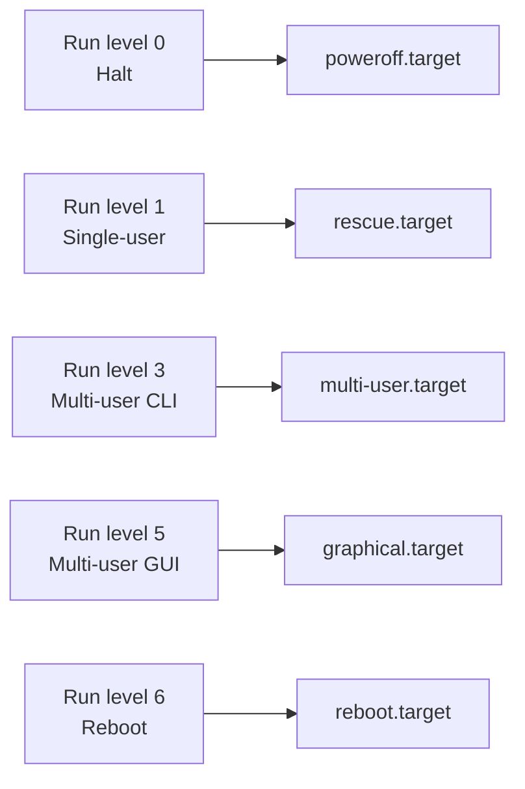

# 01 · Run Levels & systemd Targets

[⬅ Back to index](../README.md) · [Next: The Boot Process ➡](02-boot-process.md)

---

## 🎯 What is a run level?

A **run level** is a *preset state of the machine* — it decides **which services are running**.

> 🏠 **Analogy:** Think of your house having "modes":
> - **Sleep mode** — lights off, doors locked (minimal services).
> - **Normal mode** — lights on, WiFi up, everyone home (full services).
> - **Party mode** — music, extra lights (graphical desktop).
>
> A run level is exactly that: a named "mode" the whole computer switches into.

Run levels come from the old **SysV init** system. Modern Linux replaced them with **systemd targets**, but the idea (and the vocabulary) is still everywhere, so learn both.

---

## 📊 The classic SysV run levels (0–6)

| Run level | State | What it's for |
|:---:|-------|---------------|
| **0** | Halt | Powers the machine **off** |
| **1** (or `S`) | Single-user | Rescue / maintenance — root only, no network |
| **2** | Multi-user, no network FS | Multi-user without NFS |
| **3** | Multi-user + network | **Standard server mode** — text only, no GUI |
| **4** | Unused | Reserved for custom setups |
| **5** | Multi-user + GUI | Graphical desktop login |
| **6** | Reboot | **Restarts** the machine |

> [!TIP]
> For servers, you almost always want **run level 3** (networked, text mode). Level 5 adds a graphical desktop you rarely need on a headless server or cloud instance.

---

## 🔄 The modern equivalent: systemd targets

`systemd` replaced numbered run levels with **named targets**. A *target* is just a group of services brought up together — and it understands dependencies, so services start in parallel (much faster boot).



| Old run level | systemd target | Compatibility alias |
|:---:|-------------------|-------------------|
| 0 | `poweroff.target` | `runlevel0.target` |
| 1 | `rescue.target` | `runlevel1.target` |
| 3 | `multi-user.target` | `runlevel3.target` |
| 5 | `graphical.target` | `runlevel5.target` |
| 6 | `reboot.target` | `runlevel6.target` |

---

## 🧪 Hands-on

### 1. See the current & default target

```bash
# What target does the system boot into by default?
systemctl get-default
#   → multi-user.target

# Old command still works (shows the number)
runlevel
#   → N 3        # 'N' = no previous level, current = 3

who -r
#   → run-level 3  2025-06-01 09:14
```

### 2. Switch to another mode right now (temporary)

```bash
# Drop to text multi-user mode immediately
sudo systemctl isolate multi-user.target

# Go to graphical desktop (if installed)
sudo systemctl isolate graphical.target

# Emergency / rescue (single-user) modes
sudo systemctl rescue
sudo systemctl emergency
```

> `isolate` changes the state **now** but does **not** survive a reboot.

### 3. Change the default mode (permanent)

```bash
# Make the server always boot into text mode
sudo systemctl set-default multi-user.target

# Verify — it just repoints a symlink
ls -l /etc/systemd/system/default.target
#   → default.target -> /usr/lib/systemd/system/multi-user.target
```

---

## ⚠️ Common mistakes

- **Setting `graphical.target` on a server with no GUI installed** → boot hangs waiting for a display manager. Fix: boot to rescue and `systemctl set-default multi-user.target`.
- **Confusing `isolate` (temporary) with `set-default` (permanent).**

---

## ✅ Key takeaways

- Run levels are SysV's numbered machine states **0–6**.
- systemd replaced them with **named targets**; `multi-user.target` = level 3 (server), `graphical.target` = level 5 (desktop).
- Read/change the boot mode with `systemctl get-default` / `set-default`, and switch on the fly with `systemctl isolate`.

## 💬 Interview questions

1. *What is the difference between run level 3 and 5?* → 3 is multi-user text mode; 5 adds a graphical desktop.
2. *How do you make a server boot without a GUI?* → `systemctl set-default multi-user.target`.
3. *Difference between `isolate` and `set-default`?* → `isolate` switches now (temporary); `set-default` persists across reboot.

---

[⬅ Back to index](../README.md) · [Next: The Boot Process ➡](02-boot-process.md)
