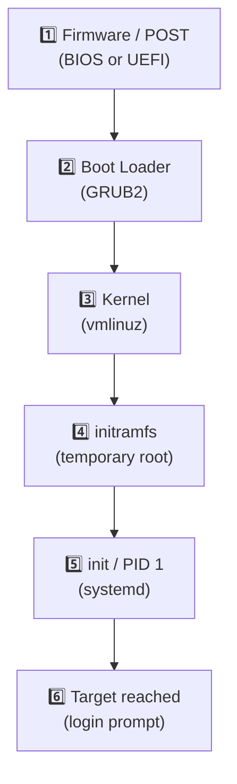

# 02 · The Linux Boot Process

[⬅ Previous: Run Levels](01-run-levels.md) · [Back to index](../README.md) · [Next: systemd-analyze ➡](03-systemd-analyze.md)

---

## 🎯 What is "booting"?

**Booting** is everything that happens between pressing the **power button** and seeing the **login prompt**.

> 🏃 **Analogy — a relay race:** Each runner (stage) carries the baton a short distance, then hands it to the next, faster runner. No single stage does everything; each just loads and starts the next one.

Understanding this chain is the #1 skill for fixing a machine that **won't boot** — because you can pinpoint *which handoff broke*.

---

## 🗺️ The 6 stages at a glance



| # | Stage | Component | Hands the baton to |
|:-:|-------|-----------|--------------------|
| 1 | Firmware / POST | BIOS or UEFI | Boot device + boot loader |
| 2 | Boot loader | GRUB2 | Kernel + initramfs |
| 3 | Kernel | `vmlinuz` | initramfs, then PID 1 |
| 4 | initramfs | temporary root FS | The real root filesystem |
| 5 | init (PID 1) | `systemd` | Target units & services |
| 6 | Runtime target | `multi-user` / `graphical` | The login prompt |

---

## 🔍 Stage-by-stage detail

### 1️⃣ Firmware & POST

When power hits the board, the firmware (**BIOS** on older machines, **UEFI** on modern ones) runs a **POST** (Power-On Self-Test) to check RAM, CPU and essential hardware, then finds a bootable disk.

- **BIOS** reads the first **512 bytes** of the disk — the **MBR** (Master Boot Record) — which holds the stage-1 boot loader.
- **UEFI** reads a small FAT partition (the **EFI System Partition**, usually `/boot/efi`) and launches a `.efi` boot program directly. UEFI supports **Secure Boot** and disks larger than 2 TB.

### 2️⃣ Boot loader — GRUB2

On the RHEL family the boot loader is **GRUB2**. Its job: find the kernel, load it + initramfs into memory, pass kernel options, and hand over control. GRUB also shows the **boot menu** where you can pick a kernel or edit boot options.

**Key files:**

| Path | Purpose |
|------|---------|
| `/etc/default/grub` | **You edit this** (timeout, default entry, kernel options) |
| `/etc/grub.d/` | Scripts that build the menu |
| `/boot/grub2/grub.cfg` | **Generated** config (BIOS) — *don't edit by hand* |
| `/boot/efi/EFI/<distro>/grub.cfg` | Generated config (UEFI) |

**Regenerate GRUB after a change:**

```bash
sudo vi /etc/default/grub          # edit the source of truth

# BIOS systems:
sudo grub2-mkconfig -o /boot/grub2/grub.cfg
# UEFI systems:
sudo grub2-mkconfig -o /boot/efi/EFI/redhat/grub.cfg
```

> [!WARNING]
> **Never hand-edit `grub.cfg`.** It's machine-generated and gets overwritten on every kernel update. Always change `/etc/default/grub` and re-run `grub2-mkconfig`.

**Rescue trick — edit boot options temporarily:** at the GRUB menu press `e`, find the line starting with `linux`, append a parameter, then `Ctrl+X` to boot once. Useful parameters:

- `rd.break` — break into the initramfs shell (used to reset a lost root password).
- `systemd.unit=rescue.target` — force single-user rescue mode.
- `init=/bin/bash` — boot straight to a shell, skipping systemd.

### 3️⃣ The Kernel

GRUB loads `/boot/vmlinuz-<version>` into memory. The kernel decompresses itself, initialises the CPU, memory, and core hardware, mounts the **initramfs**, and starts the first user-space process — **PID 1**.

```bash
ls -l /boot/vmlinuz-*      # installed kernels
uname -r                   # the kernel currently running
#   → 5.10.223-212.873.amzn2.x86_64
```

### 4️⃣ initramfs (initial RAM filesystem)

The **initramfs** (`/boot/initramfs-<version>.img`) is a tiny temporary filesystem loaded into RAM. It contains *just enough drivers* to find and mount the **real** root filesystem — which might live on LVM, RAID, an encrypted volume, or an NVMe device whose driver isn't built into the kernel. Once the real root is mounted, control "pivots" to it and initramfs is discarded.

```bash
# initramfs is built by 'dracut' on RHEL family — rebuild it:
sudo dracut -f

# Peek inside the current one:
lsinitrd /boot/initramfs-$(uname -r).img | less
```

### 5️⃣ systemd (PID 1)

On modern Linux, **PID 1 is `systemd`**. It reads unit files, resolves dependencies, and starts services **in parallel** until it reaches the `default.target`. That parallelism is why systemd boots far faster than the old sequential SysV scripts.

```bash
ps -p 1 -o comm=          # confirm PID 1
#   → systemd
systemctl --failed        # anything that failed this boot
```

- Unit files live in `/usr/lib/systemd/system/` (packaged) and `/etc/systemd/system/` (your overrides — higher priority).

### 6️⃣ Target reached → login

Finally systemd reaches `multi-user.target` (text) or `graphical.target` (GUI), starts `getty` login prompts (or a display manager), and **boot is complete**.

---

## 🧠 One-line recap

> **Firmware (POST) → GRUB2 → Kernel (vmlinuz) → initramfs → systemd (PID 1) → default.target → login prompt**

---

## 🩺 Boot troubleshooting map

Match the symptom to the broken handoff:

| Symptom | Likely broken stage | First thing to check |
|---------|--------------------|----------------------|
| Blank screen, no GRUB menu | Firmware / disk / MBR | Boot order, disk detected? |
| GRUB menu but kernel won't load | GRUB / kernel | Corrupt `vmlinuz`, bad `grub.cfg` |
| "Cannot find root device" / dracut shell | initramfs | Missing storage driver, wrong `root=`/fstab UUID |
| Boots then hangs on a service | systemd unit | `systemctl --failed`, `journalctl -b` |

```bash
# The two commands you'll use most when a boot goes wrong:
systemctl --failed        # which units failed
journalctl -b             # full log of THIS boot (-b = boot)
journalctl -xb            # with extra explanations
```

---

## ✅ Key takeaways

- Boot is a **6-stage relay**: Firmware → GRUB2 → Kernel → initramfs → systemd → target.
- `initramfs` exists to load drivers needed to reach the **real** root filesystem.
- **PID 1 = systemd**, which starts everything else in parallel.
- To debug: identify *which handoff broke*, then use `systemctl --failed` and `journalctl -b`.

## 💬 Interview questions

1. *Walk me through the Linux boot process.* → the 6 stages above.
2. *What is initramfs and why is it needed?* → temporary RAM filesystem with drivers to mount the real root.
3. *What is PID 1?* → the first user-space process, `systemd`.
4. *How would you reset a lost root password?* → boot with `rd.break`, remount `/sysroot` rw, `chroot`, `passwd`, relabel SELinux.

---

[⬅ Previous: Run Levels](01-run-levels.md) · [Back to index](../README.md) · [Next: systemd-analyze ➡](03-systemd-analyze.md)
