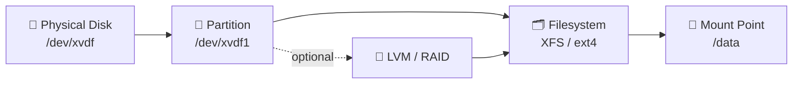

# 05 · Linux Storage Basics

[⬅ Previous: MOTD](04-motd.md) · [Back to index](../README.md) · [Next: Disk Partitioning ➡](06-disk-partitioning.md)

---

## 🎯 The big picture

Before we resize volumes or build RAID, you need the mental model of **how storage is layered** in Linux.



> 🏗️ **Analogy:** A disk is a plot of **land**. A **partition** is a fenced section of that plot. A **filesystem** is the house you build on it (with rooms = folders). The **mount point** is the front door you walk through to get inside (`/data`).

You can go straight `disk → partition → filesystem`, or insert **LVM** or **RAID** in the middle for flexibility and redundancy (covered in later topics).

---

## 🏷️ How disks are named

Linux exposes every disk as a file under `/dev/`. The name tells you the type:

| Device pattern | Meaning |
|----------------|---------|
| `/dev/sda`, `/dev/sdb` | SCSI / SATA / SAS / USB disk. Letter = disk (`sda1` = 1st partition of 1st disk) |
| `/dev/nvme0n1` | NVMe SSD. `nvme0` = controller, `n1` = namespace, `p1` = partition |
| `/dev/xvda` | Xen virtual disk (older EC2) |
| `/dev/vda` | virtio disk (KVM / many clouds) |
| `/dev/mapper/vg-lv` | LVM logical volume |
| `/dev/md0` | Software RAID array |

> [!NOTE]
> On **AWS EC2**, disks usually appear as `/dev/xvdX` (older) or `/dev/nvmeXn1` (Nitro instances). The device name can even **change across reboots** — which is exactly why we mount by **UUID**, not device name (see next topic).

---

## 🧪 Hands-on — inspect what you have

### `lsblk` — your #1 storage command

```bash
lsblk
```
```text
NAME          MAJ:MIN RM  SIZE RO TYPE MOUNTPOINT
xvda          202:0    0   20G  0 disk
├─xvda1       202:1    0    1M  0 part
└─xvda2       202:2    0   20G  0 part /
xvdf          202:80   0   10G  0 disk
```
It shows disks, partitions, sizes, and **where each is mounted** — in one tree.

```bash
lsblk -f          # add filesystem type + UUID columns
```

### `blkid` — UUIDs and filesystem types

```bash
sudo blkid
#   /dev/xvda2: UUID="a1b2c3d4-..." TYPE="xfs"
```

### `fdisk -l` — classic full listing

```bash
sudo fdisk -l
```

> [!TIP]
> **Before touching any storage, run `lsblk` (or `lsblk -f`).** It's the single most useful command here — it shows you exactly what's connected, how big it is, and whether it's already in use. This one habit prevents most "oops I wiped the wrong disk" disasters.

---

## ✅ Key takeaways

- Storage is layered: **disk → partition → (LVM/RAID) → filesystem → mount point**.
- Disk names under `/dev/` indicate the type (`sd*`, `nvme*`, `xvd*`).
- Device names can change; **mount by UUID**.
- `lsblk`, `blkid`, `fdisk -l` are your inspection tools — **always look before you leap**.

## 💬 Interview questions

1. *How do you list all block devices and mount points?* → `lsblk` / `lsblk -f`.
2. *Why mount by UUID instead of device name?* → device names (`/dev/xvdf`) can change across reboots; UUIDs are stable.

---

[⬅ Previous: MOTD](04-motd.md) · [Back to index](../README.md) · [Next: Disk Partitioning ➡](06-disk-partitioning.md)
