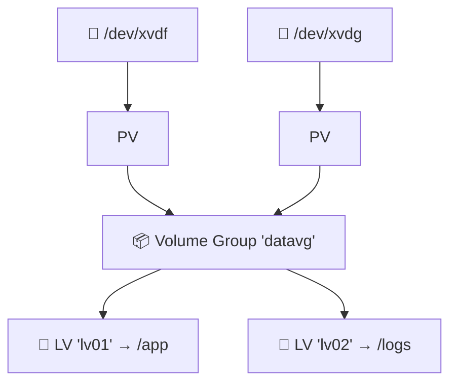
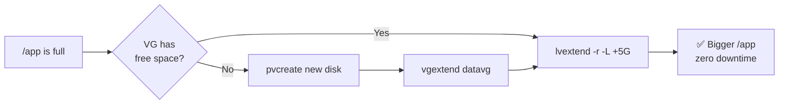

# 08 · LVM — Logical Volume Manager

[⬅ Previous: The df Command](07-df-command.md) · [Back to index](../README.md) · [Next: Swap Space ➡](09-swap-space.md)

---

## 🎯 What is LVM and why should you care?

**LVM** puts a flexible layer *between* your physical disks and your filesystems. Instead of formatting a partition directly, you **pool** disks and carve **resizable** volumes out of the pool.

**The killer feature:** you can **grow a filesystem while it's in use — zero downtime.** Without LVM, growing a filesystem means repartitioning, which usually means downtime and risk.

> 🧱 **Analogy — LEGO bricks:**
> - **PVs** are individual LEGO bricks (your disks).
> - A **VG** is the big bucket you dump all the bricks into (the pool).
> - **LVs** are the walls you build from the bucket.
>
> Running low? Add more bricks to the bucket (extend the VG), then make your wall taller (extend the LV). No need to tear anything down.

---

## 🏗️ The three LVM layers



| Term | Abbr | What it is |
|------|:---:|------------|
| **Physical Volume** | PV | A disk/partition initialised for LVM (`pvcreate`) |
| **Volume Group** | VG | A pool made of one or more PVs (`vgcreate`) |
| **Logical Volume** | LV | A "virtual partition" carved from a VG — gets the filesystem (`lvcreate`) |
| **Physical Extent** | PE | The fixed-size allocation unit (default 4 MB) a VG is divided into |

---

## 🧪 Hands-on Part 1 — Create LVM from scratch

Build a 15 GB volume from two disks, `/dev/xvdf` and `/dev/xvdg`:

```bash
# 1. Initialise the disks as Physical Volumes
sudo pvcreate /dev/xvdf /dev/xvdg
sudo pvs                       # list PVs

# 2. Create a Volume Group 'datavg' from them
sudo vgcreate datavg /dev/xvdf /dev/xvdg
sudo vgs                       # list VGs

# 3. Create a 15G Logical Volume 'lv01'
sudo lvcreate -L 15G -n lv01 datavg
#    -l 100%FREE  would use ALL free space instead of a fixed size
sudo lvs                       # list LVs

# 4. Format and mount it (device path = /dev/<vg>/<lv>)
sudo mkfs.xfs /dev/datavg/lv01
sudo mkdir -p /app
sudo mount /dev/datavg/lv01 /app
df -hT /app
```

> 💡 Inspect anything with the matching `*display` commands: `pvdisplay`, `vgdisplay`, `lvdisplay`.

---

## 🧪 Hands-on Part 2 — Extending LVM (the #1 real-world skill)

Growing a volume that's running out of space is *the* everyday LVM task. There are two scenarios.

### Scenario A — the VG still has free space

```bash
# Check free space in the VG
sudo vgs
#   VG      #PV #LV #SN Attr   VSize  VFree
#   datavg    2   1   0 wz--n- 19.99g  4.99g   ← 5G free

# Extend the LV by 5G
sudo lvextend -L +5G /dev/datavg/lv01

# Grow the FILESYSTEM to fill the bigger LV (XFS: by mount point, online)
sudo xfs_growfs /app
#   ext4 equivalent: sudo resize2fs /dev/datavg/lv01

df -h /app     # bigger now — no downtime!
```

> [!TIP]
> **One-shot extend + grow:** `lvextend` can resize the filesystem for you with `-r`:
> ```bash
> sudo lvextend -r -L +5G /dev/datavg/lv01
> ```
> The `-r` (`--resizefs`) flag automatically calls `xfs_growfs` or `resize2fs`. Fewer steps, fewer mistakes.

### Scenario B — the VG itself is full: add a new disk first

```bash
# 1. New disk /dev/xvdh attached — make it a PV
sudo pvcreate /dev/xvdh

# 2. Add it INTO the existing VG (this grows the pool)
sudo vgextend datavg /dev/xvdh
sudo vgs                        # VFree just jumped up

# 3. Now extend the LV + filesystem in one go
sudo lvextend -r -l +100%FREE /dev/datavg/lv01
df -h /app
```



---

## 📸 Bonus — LVM snapshots

A **snapshot** is a point-in-time copy — perfect for taking a safe backup or testing a risky change with an easy rollback.

```bash
# Create a snapshot before a risky change
sudo lvcreate -L 2G -s -n lv01_snap /dev/datavg/lv01
#   -s = snapshot; the 2G holds changed blocks while the snapshot lives

# If things go wrong, roll back:
sudo umount /app
sudo lvconvert --merge /dev/datavg/lv01_snap
sudo mount /app
```

---

## ⚠️ Shrinking is dangerous

> [!CAUTION]
> - **XFS cannot shrink** — only grow. Full stop.
> - **ext4 can shrink**, but you must `umount`, then `resize2fs` to the smaller size **first**, then `lvreduce`. Getting the order wrong **destroys data**.
> - When in doubt: don't shrink — **migrate** to a new, smaller volume instead.

---

## ✅ Key takeaways

- LVM = **PV → VG → LV**; it lets you resize storage **online, with no downtime**.
- Create: `pvcreate` → `vgcreate` → `lvcreate` → `mkfs` → `mount`.
- Grow (VG has room): `lvextend -r -L +5G`.
- Grow (VG full): `pvcreate` new disk → `vgextend` → `lvextend -r`.
- **Growing is safe and easy; shrinking is risky (XFS can't shrink at all).**

## 💬 Interview questions

1. *Explain PV, VG, LV.* → physical volume (disk), volume group (pool), logical volume (usable "partition").
2. *How do you extend a filesystem with zero downtime?* → `lvextend -r` then it grows XFS/ext4 online.
3. *Can you shrink XFS?* → No. XFS only grows; you'd migrate instead.

---

[⬅ Previous: The df Command](07-df-command.md) · [Back to index](../README.md) · [Next: Swap Space ➡](09-swap-space.md)
