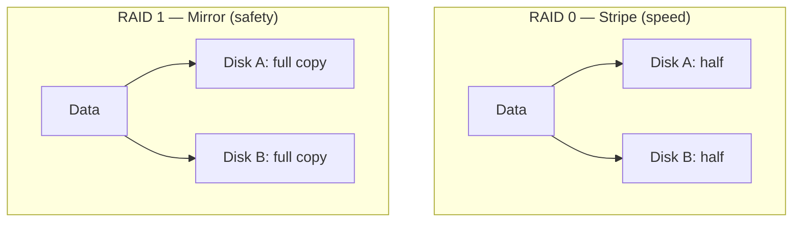

# 11 · RAID — Redundant Array of Independent Disks

[⬅ Previous: XFS Filesystem](10-xfs-filesystem.md) · [Back to index](../README.md) · [Next: Filesystem Check ➡](12-filesystem-check-fsck.md)

---

## 🎯 What is RAID?

**RAID** combines several physical disks into **one logical unit** to gain **speed**, **redundancy**, or both.

> 🚚 **Analogy:**
> - **Speed (striping):** two movers each carry half the boxes at once — the job finishes in half the time.
> - **Redundancy (mirroring):** you photocopy every document. Lose one copy, the other survives.
>
> RAID levels are just different mixes of "split the work" and "keep a backup copy."

On Linux, **software RAID** is managed by **`mdadm`** and appears as `/dev/mdX`.

---

## 📊 The common RAID levels

| Level | Min disks | Redundancy | Trade-off | Use case |
|:-----:|:---------:|------------|-----------|----------|
| **RAID 0** | 2 | ❌ None (stripe) | Max speed + capacity, **any disk fails = all data lost** | Scratch/cache data |
| **RAID 1** | 2 | ✅ 1 disk (mirror) | Half the usable space | OS / boot volumes |
| **RAID 5** | 3 | ✅ 1 disk (parity) | Good balance | General servers |
| **RAID 6** | 4 | ✅ 2 disks (double parity) | Survives 2 failures | Large arrays |
| **RAID 10** | 4 | ✅ mirror + stripe | Speed **and** redundancy, needs 2× space | Databases |



> [!CAUTION]
> **RAID is NOT a backup.** RAID protects against a **disk failing**. It does **not** protect against accidental deletion, corruption, ransomware, or a datacentre fire. You still need real backups (see [Backups & dd](13-backup-dd-lsblk.md)) and snapshots.

---

## 🧪 Hands-on — build a RAID 1 mirror with `mdadm`

Mirror two disks, `/dev/xvdf` and `/dev/xvdg`:

```bash
# 1. Create the mirror
sudo mdadm --create /dev/md0 --level=1 --raid-devices=2 \
     /dev/xvdf /dev/xvdg

# 2. Watch it build / check status
cat /proc/mdstat
sudo mdadm --detail /dev/md0

# 3. Put a filesystem on the array and mount it
sudo mkfs.xfs /dev/md0
sudo mkdir -p /raid && sudo mount /dev/md0 /raid

# 4. Persist the array so it re-assembles on boot
sudo mdadm --detail --scan | sudo tee -a /etc/mdadm.conf
sudo dracut -f          # rebuild initramfs to include RAID config
```

### Simulate a failure and recover

```bash
# Mark a disk as failed, remove it, add a replacement
sudo mdadm /dev/md0 --fail /dev/xvdg
sudo mdadm /dev/md0 --remove /dev/xvdg
sudo mdadm /dev/md0 --add /dev/xvdh    # rebuild starts automatically

cat /proc/mdstat                       # shows recovery progress %
```
```text
md0 : active raid1 xvdh[2] xvdf[0]
      10476544 blocks super 1.2 [2/1] [U_]
      [====>................]  recovery = 23.4% (2451200/10476544)
```

> 💡 `[U_]` means one disk is up (`U`) and one is rebuilding (`_`). When it reads `[UU]`, the mirror is healthy again.

---

## 🖥️ Hardware vs Software RAID

| | Software RAID (`mdadm`) | Hardware RAID |
|---|---|---|
| Cost | Free (built into Linux) | Needs a RAID controller card |
| CPU | Uses host CPU | Offloaded to the card |
| Portability | Move disks to any Linux box | Tied to the controller |
| Cloud | Common (EBS + mdadm) | Rare (cloud abstracts disks) |

---

## ✅ Key takeaways

- RAID mixes **striping** (speed) and **mirroring/parity** (redundancy).
- Know the levels: **0** (speed, no safety), **1** (mirror), **5/6** (parity), **10** (both).
- Linux software RAID = **`mdadm`** → `/dev/mdX`; check health with `cat /proc/mdstat`.
- **RAID is not a backup.**

## 💬 Interview questions

1. *Difference between RAID 0, 1, 5, 10?* → 0 stripe (no redundancy), 1 mirror, 5 single-parity, 10 mirror+stripe.
2. *Minimum disks for RAID 5?* → 3.
3. *Is RAID a backup?* → No — it only protects against disk failure.
4. *How do you check RAID status on Linux?* → `cat /proc/mdstat` / `mdadm --detail /dev/md0`.

---

[⬅ Previous: XFS Filesystem](10-xfs-filesystem.md) · [Back to index](../README.md) · [Next: Filesystem Check ➡](12-filesystem-check-fsck.md)
