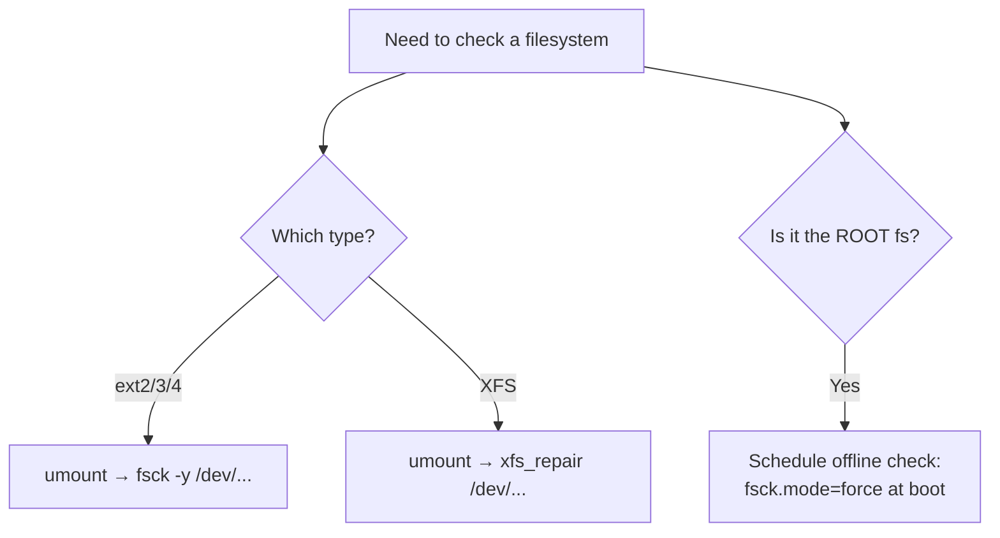

# 12 · Filesystem Check (`fsck`)

[⬅ Previous: RAID](11-raid.md) · [Back to index](../README.md) · [Next: Backups, dd & lsblk ➡](13-backup-dd-lsblk.md)

---

## 🎯 What is `fsck`?

`fsck` = **filesystem consistency check**. It inspects and repairs a filesystem's internal **metadata** — the bookkeeping that tracks which blocks belong to which files.

> 🧹 **Analogy:** Imagine a library where the catalogue got scrambled after a power cut — some books listed twice, some shelves pointing nowhere. `fsck` is the librarian who walks the shelves, compares them to the catalogue, and fixes the mismatches so the library is usable again.

**When it runs:**
- Automatically after an **unclean shutdown** (crash / power loss) — for ext filesystems.
- Manually when you suspect corruption.
- On a schedule (mount count / time-based for ext).

---

## 🔧 How `fsck` works

`fsck` is a **front-end** that calls the right tool for the filesystem type:

| Filesystem | Repair tool |
|-----------|-------------|
| ext2/3/4 | `e2fsck` (via `fsck`) |
| XFS | **`xfs_repair`** (⚠️ `fsck` does nothing on XFS) |
| Btrfs | `btrfs check` |

> [!WARNING]
> **NEVER run `fsck` on a mounted, read-write filesystem** — it can corrupt it. **Always unmount first**, or run it against the root filesystem from rescue mode / early boot.

---

## 🧪 Hands-on — checking an ext4 filesystem

```bash
# 1. Unmount the target
sudo umount /dev/xvdf1

# 2. Check (and fix) it
sudo fsck /dev/xvdf1
#   -y   answer "yes" to all repairs (non-interactive)
#   -n   answer "no" — report only, change nothing (safe dry run)
#   -f   force a check even if the filesystem looks clean

# Common real usage:
sudo fsck -y /dev/xvdf1

# Or call the ext tool directly:
sudo e2fsck -f /dev/xvdf1
```

Typical output when clean:
```text
/dev/xvdf1: clean, 25/655360 files, 79143/2621440 blocks
```

---

## 🧪 For XFS — use `xfs_repair` instead

```bash
sudo umount /dev/xvdf1
sudo xfs_repair /dev/xvdf1
#   -n  = dry run (report only)
#   -L  = last resort: zero a corrupt log (may lose recent changes)
```

> [!IMPORTANT]
> This is the most common **gotcha**: people try `fsck` on XFS and nothing happens. That's expected — **XFS's repair tool is `xfs_repair`, and the filesystem must be unmounted.**

---

## 🔁 Force a check on the ROOT filesystem at next boot

You can't unmount the root filesystem while running from it, so schedule an **offline** check that runs during early boot:

```bash
# systemd / dracut way — add to the kernel command line for one boot:
#   fsck.mode=force fsck.repair=yes
# (add via GRUB 'e' menu, or /etc/default/grub then grub2-mkconfig)

# Legacy trigger on some systems:
sudo touch /forcefsck
sudo reboot
```

---

## 🧭 Decision guide



---

## ✅ Key takeaways

- `fsck` checks/repairs filesystem **metadata** after crashes or corruption.
- **Always unmount first** (or run offline at boot for root).
- `fsck`/`e2fsck` for **ext**; **`xfs_repair`** for **XFS** (fsck does nothing on XFS).
- `-n` = safe dry run, `-y` = auto-fix, `-f` = force.

## 💬 Interview questions

1. *Why must you unmount before `fsck`?* → checking a live, writable filesystem can corrupt it.
2. *How do you repair XFS?* → `xfs_repair` (unmounted), not `fsck`.
3. *How do you fsck the root filesystem?* → schedule an offline check at boot (`fsck.mode=force`).

---

[⬅ Previous: RAID](11-raid.md) · [Back to index](../README.md) · [Next: Backups, dd & lsblk ➡](13-backup-dd-lsblk.md)
