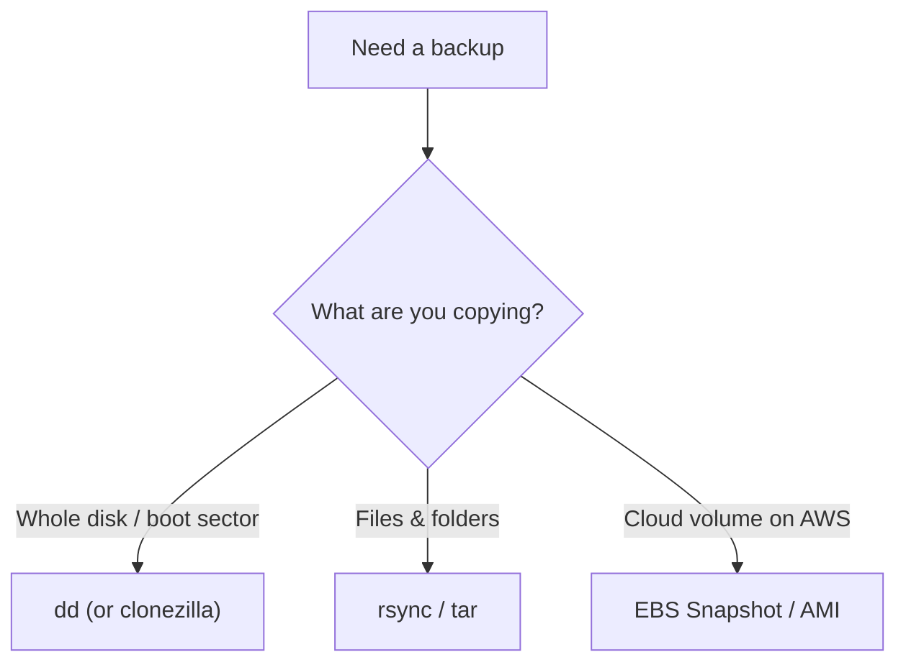

# 13 · System Backup, `dd` & `lsblk`

[⬅ Previous: Filesystem Check](12-filesystem-check-fsck.md) · [Back to index](../README.md) · [Next: NFS ➡](14-nfs.md)

---

## 🎯 What is `dd`?

`dd` copies data **block by block** — a raw, exact, byte-for-byte copy. It's the classic tool for **cloning whole disks**, **imaging partitions**, and **backing up boot sectors**.

> 📸 **Analogy:** Most copy tools copy *files* (like photographing each item in a room). `dd` photographs the **entire room in one shot**, including empty space and hidden corners — a perfect, exact duplicate at the disk level.

> [!CAUTION]
> **`dd` is nicknamed "disk destroyer."** It writes exactly where you tell it, with **no confirmation and no undo**. Swap `if=` (input) and `of=` (output) by mistake and you instantly wipe a disk. **Run `lsblk` first, every single time, to be 100% sure which device is which.**

---

## 🔍 Step 0 — always `lsblk` first

`lsblk` lists block devices so you can confirm source and destination before doing anything destructive:

```bash
lsblk -o NAME,SIZE,TYPE,MOUNTPOINT,MODEL
```
```text
NAME   SIZE TYPE MOUNTPOINT MODEL
xvda    20G disk            Amazon Elastic Block Store
└─xvda2 20G part /
xvdf    10G disk            Amazon Elastic Block Store   ← source
xvdg    10G disk            Amazon Elastic Block Store   ← destination
```
Confirm the **sizes and roles** match your intent before running `dd`.

---

## 🧪 Hands-on — `dd` recipes

Read these as: `dd if=<source> of=<destination> bs=<blocksize> [options]`

| Goal | Command |
|------|---------|
| **Clone whole disk** | `dd if=/dev/xvdf of=/dev/xvdg bs=64M status=progress` |
| **Image a disk to a file** | `dd if=/dev/xvdf of=/backup/disk.img bs=64M status=progress` |
| **Restore image to disk** | `dd if=/backup/disk.img of=/dev/xvdf bs=64M status=progress` |
| **Backup MBR (first 512 B)** | `dd if=/dev/xvda of=/backup/mbr.bin bs=512 count=1` |
| **Compress image on the fly** | `dd if=/dev/xvdf bs=64M \| gzip > /backup/disk.img.gz` |
| **Create a test file of a size** | `dd if=/dev/zero of=test.bin bs=1M count=100` |
| **Wipe a disk with zeros** | `dd if=/dev/zero of=/dev/xvdf bs=64M status=progress` |

**Handy flags:**
- `bs=` — block size. Bigger = faster; **64M** is a good default.
- `status=progress` — shows a live progress line (otherwise `dd` is silent).
- `count=` — limit how many blocks to copy (e.g. just the MBR).

```bash
# Example live output with status=progress:
#   3221225472 bytes (3.2 GB, 3.0 GiB) copied, 12 s, 268 MB/s
```

---

## 💾 Safer, complementary backup tools

`dd` is for **whole-disk / boot-sector** work. For **file-level** backups, these are safer and smarter:

```bash
# rsync — incremental, preserves permissions & ACLs, only copies changes
rsync -aAXv --delete /source/ /destination/

# tar — archive selected directory trees
tar czf backup-$(date +%F).tgz /etc /home
```

> [!TIP]
> **On AWS, the real answer for whole-volume backups is EBS Snapshots / AMIs** — they're incremental, consistent, and don't require the volume to be idle. Use `dd` for local disks, edge cases, and boot sectors; use snapshots for cloud volumes.

---

## 🧭 Which backup tool when?



---

## ✅ Key takeaways

- `dd` makes exact, block-level copies — great for **disk clones, images, and MBR backups**.
- **Always `lsblk` first**; double-check `if=` and `of=` — mistakes are instant and irreversible.
- Use `bs=64M status=progress` for speed and visibility.
- For files, prefer `rsync`/`tar`; for cloud volumes, prefer **snapshots**.

## 💬 Interview questions

1. *What does `dd` do and what's the risk?* → exact block copy; wrong `of=` wipes a disk.
2. *How do you back up just the MBR?* → `dd if=/dev/sda of=mbr.bin bs=512 count=1`.
3. *`dd` vs `rsync`?* → dd = block-level whole-disk; rsync = file-level incremental.

---

[⬅ Previous: Filesystem Check](12-filesystem-check-fsck.md) · [Back to index](../README.md) · [Next: NFS ➡](14-nfs.md)
