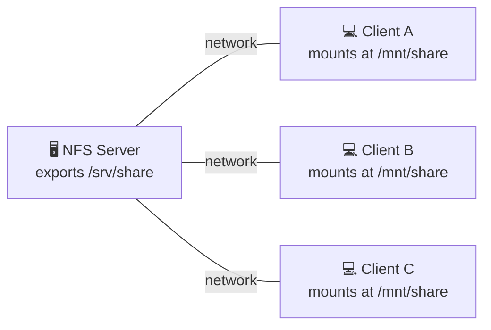

# 14 · NFS — Network File System

[⬅ Previous: Backups & dd](13-backup-dd-lsblk.md) · [Back to index](../README.md) · [Next: SATA & SAS ➡](15-sata-sas.md)

---

## 🎯 What is NFS?

**NFS** lets a server **share a folder over the network** so that other machines (clients) can **mount it and use it as if it were local**.

> 🗄️ **Analogy:** A shared filing cabinet in a central room. Everyone in the building (clients) can open the same drawer (folder) over the network. Change a file, and everyone sees the change instantly — there's only one real copy.

**Where it's used:** shared home directories, a common application data folder, a central artifact/build store, shared config across a fleet.



**Versions:** **NFSv4** (preferred) uses a single port (**2049**), is firewall-friendly and more secure. NFSv3 is older and needs several ports plus `rpcbind`.

---

## 🧪 Hands-on — NFS SERVER setup (RHEL family)

```bash
# 1. Install the NFS utilities
sudo dnf install -y nfs-utils
#    Amazon Linux 2: sudo yum install -y nfs-utils

# 2. Create and own the folder to share
sudo mkdir -p /srv/share
sudo chown nobody:nobody /srv/share
echo 'hello from the nfs server' | sudo tee /srv/share/README

# 3. Define the export in /etc/exports
#    <dir>  <who-can-access>(<options>)
echo '/srv/share  10.0.0.0/24(rw,sync,no_subtree_check)' | sudo tee /etc/exports

# 4. Apply the exports and start the service
sudo exportfs -rav          # -r re-export all, -a all, -v verbose
sudo systemctl enable --now nfs-server

# 5. Verify what's being shared
sudo exportfs -s
showmount -e localhost
```

### Common export options

| Option | Meaning |
|--------|---------|
| `rw` / `ro` | Read-write / read-only |
| `sync` | Reply only after data is safely on disk (safe; default) |
| `async` | Faster but can lose data on a crash |
| `root_squash` | Map remote root → `nobody` (secure, **default**) |
| `no_root_squash` | Let remote root **be** local root (dangerous) |
| `no_subtree_check` | Skip subtree checking (faster, recommended) |

### Open the firewall (if `firewalld` is active)

```bash
sudo firewall-cmd --permanent --add-service=nfs
sudo firewall-cmd --permanent --add-service=rpc-bind
sudo firewall-cmd --permanent --add-service=mountd
sudo firewall-cmd --reload
```

---

## 🧪 Hands-on — NFS CLIENT setup

```bash
# Install client utilities (same package)
sudo dnf install -y nfs-utils

# See what a server is exporting
showmount -e 10.0.0.10

# Mount it now (temporary)
sudo mkdir -p /mnt/share
sudo mount -t nfs 10.0.0.10:/srv/share /mnt/share
df -hT /mnt/share

# Make it permanent via /etc/fstab
echo '10.0.0.10:/srv/share  /mnt/share  nfs  defaults,_netdev  0 0' \
  | sudo tee -a /etc/fstab
sudo mount -a
```

> [!TIP]
> **Always add `_netdev`** to network mounts in `/etc/fstab`. It tells systemd to wait for the network before mounting — and not to block boot if the server is unreachable.

> [!NOTE]
> **AWS EFS is managed NFS.** Amazon EFS is NFSv4 as a service — you mount it the same way (or with the helper: `mount -t efs fs-xxxx:/ /mnt/efs`). Everything you learn here maps directly to EFS.

---

## ✅ Key takeaways

- NFS shares a server folder over the network; clients mount it like a local disk.
- **Server:** install `nfs-utils` → edit `/etc/exports` → `exportfs -rav` → start `nfs-server`.
- **Client:** `mount -t nfs server:/export /mnt` → persist in fstab with `_netdev`.
- `root_squash` and `sync` are the secure defaults; **AWS EFS = managed NFSv4**.

## 💬 Interview questions

1. *How do you share a directory over NFS?* → add it to `/etc/exports`, run `exportfs -rav`, start `nfs-server`.
2. *What does `root_squash` do?* → maps remote root to `nobody` for security.
3. *Why add `_netdev` in fstab?* → wait for the network and don't block boot on a network mount.

---

[⬅ Previous: Backups & dd](13-backup-dd-lsblk.md) · [Back to index](../README.md) · [Next: SATA & SAS ➡](15-sata-sas.md)
