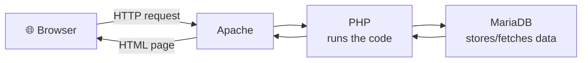

# 17 · LAMP Stack

[⬅ Previous: MySQL / MariaDB](16-mysql-mariadb.md) · [Back to index](../README.md) · [Next: Linux Distributions ➡](18-linux-distributions.md)

---

## 🎯 What is LAMP?

**LAMP** is the classic open-source stack for running web applications. It's an acronym for the four layers:

| Letter | Component | Role |
|:---:|-----------|------|
| **L** | **Linux** | The operating system |
| **A** | **Apache** | The web server (handles HTTP requests) |
| **M** | **MySQL / MariaDB** | The database (stores the data) |
| **P** | **PHP** | The language that runs the application logic |

> 🍔 **Analogy — a restaurant:**
> - **Linux** is the building.
> - **Apache** is the waiter who takes your order (HTTP request) and brings the food (web page).
> - **PHP** is the chef who cooks to order (runs the code).
> - **MySQL/MariaDB** is the pantry where all ingredients (data) are stored.



---

## 🧪 Hands-on — full LAMP install (RHEL / Amazon Linux)

Linux (**L**) is already there. Now add **A + M + P**:

```bash
# --- A: Apache (httpd) ---
sudo dnf install -y httpd
sudo systemctl enable --now httpd
#    test: curl http://localhost/   → Apache test page

# --- M: MariaDB (see topic 16) ---
sudo dnf install -y mariadb-server
sudo systemctl enable --now mariadb
sudo mysql_secure_installation

# --- P: PHP + common modules + MySQL driver ---
sudo dnf install -y php php-mysqlnd php-fpm php-cli php-json php-gd

# Apache must reload to pick up PHP
sudo systemctl restart httpd php-fpm
```

### Open the firewall for web traffic

```bash
sudo firewall-cmd --permanent --add-service=http
sudo firewall-cmd --permanent --add-service=https
sudo firewall-cmd --reload
#    On EC2, also open ports 80/443 in the Security Group.
```

---

## 🧪 Verify PHP is executing

```bash
# Drop a PHP info page into the web root
echo '<?php phpinfo(); ?>' | sudo tee /var/www/html/info.php

# Browse to  http://<server-ip>/info.php
#   → you should see the PHP configuration table.
```

> [!WARNING]
> **Remove `info.php` immediately after testing.** `phpinfo()` leaks detailed server information that attackers love.
> ```bash
> sudo rm /var/www/html/info.php
> ```

---

## 🧪 End-to-end test — PHP talks to the database

```bash
sudo tee /var/www/html/dbtest.php >/dev/null <<'EOF'
<?php
$c = new mysqli('localhost','appuser','StrongP@ss1','appdb');
echo $c->connect_error ? 'FAIL: '.$c->connect_error
                       : 'OK: connected to MariaDB';
EOF

curl http://localhost/dbtest.php
#   → OK: connected to MariaDB

sudo rm /var/www/html/dbtest.php    # clean up
```

If you see **OK**, all four layers are working together. 🎉

---

## 📁 Where things live (Apache on RHEL)

| Path | Purpose |
|------|---------|
| `/var/www/html/` | Default document root (your site files go here) |
| `/etc/httpd/conf/httpd.conf` | Main Apache config |
| `/etc/httpd/conf.d/` | Drop-in configs (virtual hosts, SSL) |
| `/var/log/httpd/` | `access_log` and `error_log` — check these when things break |

> [!NOTE]
> **LEMP variant:** swap Apache for **Nginx** (E = "engine-x") and you get **LEMP**. Nginx + php-fpm is the more common modern choice for performance, but every LAMP concept transfers directly.

---

## ✅ Key takeaways

- LAMP = **L**inux + **A**pache + **M**ariaDB/MySQL + **P**HP — the classic web stack.
- Install order: `httpd` → `mariadb-server` → `php php-mysqlnd`, then restart Apache.
- Test PHP with a temporary `phpinfo()` page (**then delete it**).
- Site files live in `/var/www/html/`; logs in `/var/log/httpd/`.
- **LEMP** = the same with Nginx instead of Apache.

## 💬 Interview questions

1. *What does LAMP stand for?* → Linux, Apache, MySQL/MariaDB, PHP.
2. *How do you confirm PHP is working with Apache?* → a temporary `phpinfo()` page in the web root.
3. *LAMP vs LEMP?* → LEMP uses Nginx instead of Apache.

---

[⬅ Previous: MySQL / MariaDB](16-mysql-mariadb.md) · [Back to index](../README.md) · [Next: Linux Distributions ➡](18-linux-distributions.md)
