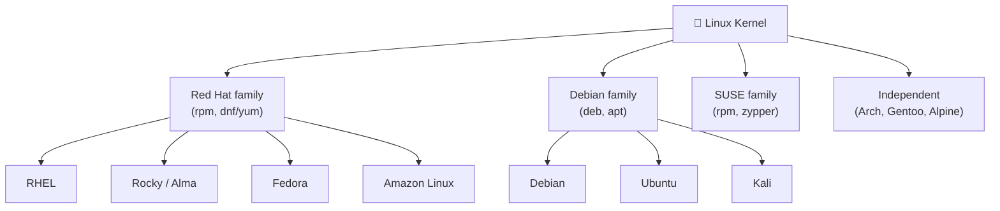
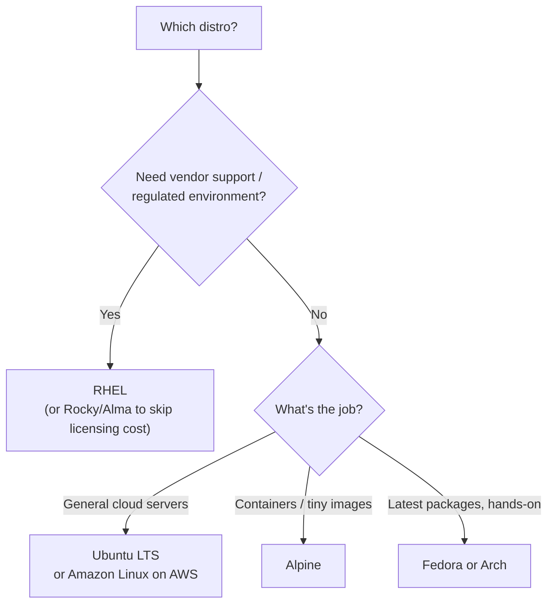

# 18 · Important Linux Distributions

[⬅ Previous: LAMP Stack](17-lamp-stack.md) · [Back to index](../README.md)

---

## 🎯 What is a "distribution"?

A **distribution** ("distro") bundles the **Linux kernel** with a **package manager**, default tools, and a **release/support policy**. The kernel is the same core everywhere; distros differ in *how they package and support it*.

> 🍦 **Analogy:** The Linux kernel is vanilla ice cream. A distro is a *flavour* — same base, different toppings, packaging, and who supports it. Ubuntu, RHEL, and Alpine are all "Linux," just served differently.

**Why it matters:** the distro **family** tells you the **package manager** and command style — so once you know the family, you know how to install software, read logs, and manage services.

---

## 🔴 The RHEL / Red Hat family (`dnf`/`yum`, `.rpm`)

| Distro | Notes |
|--------|-------|
| **RHEL** | Commercial, paid support; the enterprise standard |
| **CentOS Stream** | Rolling preview that feeds the next RHEL minor release |
| **Rocky Linux / AlmaLinux** | Free, 1:1 RHEL-compatible rebuilds (the CentOS successors) |
| **Fedora** | Upstream, cutting-edge; where future RHEL features are trialed |
| **Amazon Linux 2 / 2023** | AWS-tuned, RHEL/Fedora-derived; default on many EC2 AMIs |
| **Oracle Linux** | RHEL-compatible with Oracle support |

## 🟠 The Debian family (`apt`, `.deb`)

| Distro | Notes |
|--------|-------|
| **Debian** | Rock-stable, community-run, huge package base; servers |
| **Ubuntu** | Debian-based, polished, LTS releases; the most popular cloud/dev distro |
| **Linux Mint / Pop!\_OS** | Ubuntu-based desktops focused on usability |
| **Kali** | Debian-based, security / pen-testing toolset |

## 🟢 Other notable families

| Distro | Family / package mgr | Known for |
|--------|----------------------|-----------|
| **openSUSE / SLES** | zypper, `.rpm` | Enterprise (SUSE), great admin tooling (YaST) |
| **Arch Linux** | pacman | Rolling release, DIY, bleeding edge |
| **Gentoo** | portage (source) | Compile-from-source, maximum control |
| **Alpine** | apk (musl libc) | Tiny (~5 MB); the default base for **containers** |

---

## 🔄 Package-manager cheat sheet (translate between families)

This one table lets you work on **any** Linux box:

| Action | RHEL (`dnf`/`yum`) | Debian (`apt`) |
|--------|--------------------|----------------|
| Update package index | `dnf check-update` | `apt update` |
| Upgrade everything | `dnf upgrade` | `apt upgrade` |
| Install a package | `dnf install pkg` | `apt install pkg` |
| Remove a package | `dnf remove pkg` | `apt remove pkg` |
| Search | `dnf search term` | `apt search term` |
| Which package owns a file | `rpm -qf /path` | `dpkg -S /path` |
| List installed packages | `rpm -qa` | `dpkg -l` |

---

## 🧭 How to choose a distro

- **Enterprise / regulated / need support** → RHEL (or Rocky/Alma for free).
- **Cloud & general servers, big community** → Ubuntu LTS, or **Amazon Linux** on AWS.
- **Containers / minimal images** → **Alpine** (or distroless).
- **Latest packages, willing to maintain** → Fedora or Arch.

> [!TIP]
> If your day-to-day is AWS, focus on the **RHEL family** (Amazon Linux, RHEL): master `dnf`/`yum`, `systemd`, `XFS`, and `firewalld` and you're covered for ~90% of enterprise Linux work. Keep the **apt** translations handy for the Ubuntu boxes you'll inevitably meet.

---

## ✅ Key takeaways

- A distro = kernel + package manager + tooling + support policy.
- Two big families you'll meet most: **Red Hat** (`dnf`/`.rpm`) and **Debian** (`apt`/`.deb`).
- Know the **package-manager translation table** — it makes you productive on any box.
- Pick by need: RHEL/Rocky for enterprise, Ubuntu/Amazon Linux for cloud, Alpine for containers.

## 💬 Interview questions

1. *RHEL vs Ubuntu — package managers?* → RHEL uses `dnf`/`yum` (`.rpm`); Ubuntu uses `apt` (`.deb`).
2. *Why is Alpine popular for containers?* → it's tiny (~5 MB) and minimal.
3. *What are Rocky and AlmaLinux?* → free, 1:1 RHEL-compatible rebuilds that replaced CentOS.

---

🎉 **You've reached the end of the series!** You now understand the boot chain, the full storage stack (partitions → LVM → RAID → filesystems), and the network/database/web services built on top of it.

[⬅ Previous: LAMP Stack](17-lamp-stack.md) · [Back to index](../README.md)
